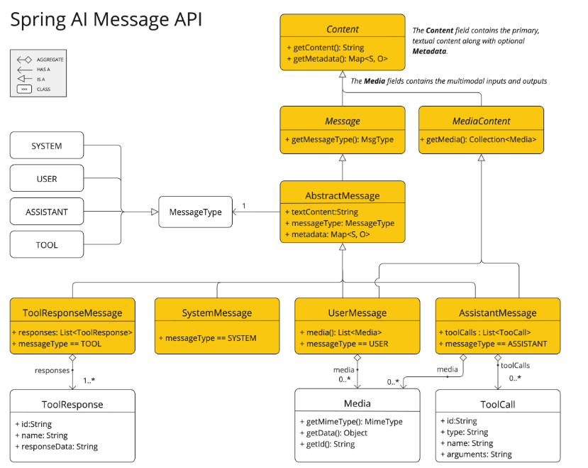
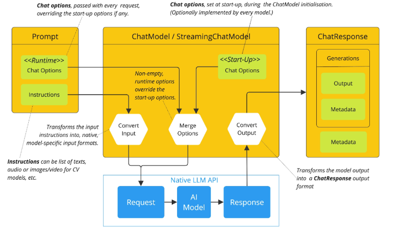
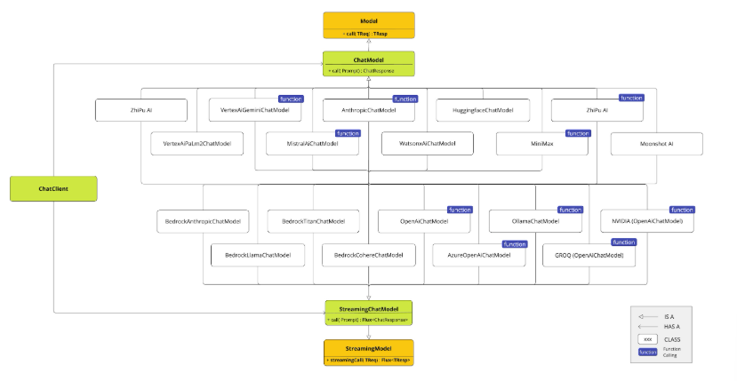

## Chat Model API

### 概述

Chat Model API 为开发人员提供了将 AI 驱动的聊天完成功能集成到其应用程序中的能力。它利用预训练的语言模型，如 GPT（生成式预训练转换器），以自然语言生成对用户输入的人类般响应。

API 通常通过向 AI 模型发送提示或部分对话来工作，然后 AI 模型基于其训练数据和对自然语言模式的理解生成完成或对话的延续。完成的响应随后返回给应用程序，应用程序可以将其呈现给用户或用于进一步处理。

`Spring AI Chat Model API` 设计为一个简单且可移植的接口，用于与各种 AI 模型交互，允许开发人员以最小的代码更改在不同模型之间切换。这种设计与 Spring 的模块化和可互换性理念保持一致。

同时，借助 `Prompt` 用于输入封装和 `ChatResponse` 用于输出处理的配套类，Chat Model API 统一了与 AI 模型的通信。它管理请求准备和响应解析的复杂性，提供直接和简化的 API 交互。

您可以在可用实现部分找到更多关于可用实现的信息，以及在聊天模型比较部分找到详细的比较。

### API 概述

#### ChatModel

这是 ChatModel 接口定义：

```java
public interface ChatModel extends Model<Prompt, ChatResponse> {

    default String call(String message) {...}

    @Override
    ChatResponse call(Prompt prompt);
}
```

带 `String` 参数的 `call()` 方法简化了初始使用，避免了更复杂的 `Prompt` 和 `ChatResponse` 类的复杂性。在实际应用程序中，更常见的是使用接受 `Prompt` 实例并返回 `ChatResponse` 的 `call()` 方法。

#### StreamingChatModel

这是 `StreamingChatModel` 接口定义：

```java
public interface StreamingChatModel extends StreamingModel<Prompt, ChatResponse> {

    default Flux<String> stream(String message) {...}

    @Override
    Flux<ChatResponse> stream(Prompt prompt);
}
```

`stream()` 方法接受类似于 `ChatModel` 的 `String` 或 `Prompt` 参数，但它使用响应式 Flux API 流式传输响应。

#### Prompt

`Prompt` 是一个 `ModelRequest`，它封装了一个 `Message` 对象列表和可选的模型请求选项。以下列表显示了 `Prompt` 类的截断版本，不包括构造函数和其他实用方法：

```java
public class Prompt implements ModelRequest<List<Message>> {

    private final List<Message> messages;

    private ChatOptions modelOptions;

    @Override
    public ChatOptions getOptions() {...}

    @Override
    public List<Message> getInstructions() {...}

    // constructors and utility methods omitted
}
```

#### Message

`Message` 接口封装了 `Prompt` 文本内容、元数据属性集合和称为 `MessageType` 的分类。

接口定义如下：

```java
public interface Content {

    String getText();

    Map<String, Object> getMetadata();
}

public interface Message extends Content {

    MessageType getMessageType();
}
```

多模态消息类型还实现了 `MediaContent` 接口，提供 `Media` 内容对象列表。

```java
public interface MediaContent extends Content {

    Collection<Media> getMedia();

}
```

`Message` 接口有各种实现，对应于 AI 模型可以处理的消息类别。



聊天完成端点根据对话角色区分消息类别，有效地由 `MessageType` 映射。

例如，OpenAI 识别不同对话角色的消息类别，如 `system`、`user`、`function` 或 `assistant`。

虽然术语 `MessageType` 可能暗示特定的消息格式，但在这种情况下，它实际上指定了消息在对话中扮演的角色。

对于不使用特定角色的 AI 模型，`UserMessage` 实现作为标准类别，通常表示用户生成的查询或指令。要了解 `Prompt` 和 `Message` 的实际应用和关系，特别是在这些角色或消息类别的上下文中，请参阅提示部分中的详细解释。

#### Chat Options

表示可以传递给 AI 模型的选项。`ChatOptions` 类是 `ModelOptions` 的子类，用于定义可以传递给 AI 模型的几个便携选项。`ChatOptions` 类定义如下：

```java
public interface ChatOptions extends ModelOptions {

    String getModel();
    Float getFrequencyPenalty();
    Integer getMaxTokens();
    Float getPresencePenalty();
    List<String> getStopSequences();
    Float getTemperature();
    Integer getTopK();
    Float getTopP();
    ChatOptions copy();

}
```

此外，每个特定于模型的 ChatModel/StreamingChatModel 实现都可以有自己的选项，可以传递给 AI 模型。例如，OpenAI Chat Completion 模型有自己的选项，如 `logitBias`、`seed` 和 `user`。

这是一个强大的功能，允许开发人员在启动应用程序时使用特定于模型的选项，然后使用 `Prompt` 请求在运行时覆盖它们。

Spring AI 提供了一个复杂的系统来配置和使用聊天模型。它允许在启动时设置默认配置，同时还提供了在每次请求的基础上覆盖这些设置的灵活性。这种方法使开发人员能够轻松地使用不同的 AI 模型并根据需要调整参数，所有这些都在 Spring AI 框架提供的一致接口内。

以下是 Spring AI 处理聊天模型配置和执行的流程：



1. **启动配置**：ChatModel/StreamingChatModel 使用"启动"聊天选项初始化。这些选项在 ChatModel 初始化期间设置，旨在提供默认配置。
2. **运行时配置**：对于每个请求，Prompt 可以包含运行时聊天选项：这些可以覆盖启动选项。
3. **选项合并过程**："合并选项"步骤结合了启动和运行时选项。如果提供了运行时选项，它们优先于启动选项。
4. **输入处理**："转换输入"步骤将输入指令转换为本机、特定于模型的格式。
5. **输出处理**："转换输出"步骤将模型的响应转换为标准化的 `ChatResponse` 格式。

启动和运行时选项的分离允许全局配置和请求特定的调整。

#### ChatResponse

`ChatResponse` 类的结构如下：

```java
public class ChatResponse implements ModelResponse<Generation> {

    private final ChatResponseMetadata chatResponseMetadata;
    private final List<Generation> generations;

    @Override
    public ChatResponseMetadata getMetadata() {...}

    @Override
    public List<Generation> getResults() {...}

    // other methods omitted
}
```

`ChatResponse` 类保存 AI 模型的输出，每个 `Generation` 实例包含来自单个提示的潜在多个输出之一。`ChatResponse` 类还携带有关 AI 模型响应的 `ChatResponseMetadata` 元数据。

#### Generation

[Generation](https://github.com/spring-projects/spring-ai/blob/main/spring-ai-model/src/main/java/org/springframework/ai/chat/model/Generation.java) 类从 `ModelResult` 扩展，表示模型输出（助手消息）和相关元数据：

```java
public class Generation implements ModelResult<AssistantMessage> {

    private final AssistantMessage assistantMessage;
    private ChatGenerationMetadata chatGenerationMetadata;

    @Override
    public AssistantMessage getOutput() {...}

    @Override
    public ChatGenerationMetadata getMetadata() {...}

    // other methods omitted
}
```

### 可用实现

此图说明了统一的接口 `ChatModel` 和 `StreamingChatModel` 用于与来自不同提供商的各种 AI 聊天模型交互，允许轻松集成和在不同 AI 服务之间切换，同时为客户端应用程序维护一致的 API。



可用的聊天模型实现包括：

- OpenAI 聊天完成（支持流式传输、多模态和函数调用）
- Microsoft Azure Open AI 聊天完成（支持流式传输和函数调用）
- Ollama 聊天完成（支持流式传输、多模态和函数调用）
- Hugging Face 聊天完成（不支持流式传输）
- Google Vertex AI Gemini 聊天完成（支持流式传输、多模态和函数调用）
- Amazon Bedrock
- Mistral AI 聊天完成（支持流式传输和函数调用）
- Anthropic 聊天完成（支持流式传输和函数调用）

提示：在聊天模型比较部分找到可用聊天模型的详细比较。

### Chat Model API

Spring AI Chat Model API 构建在 Spring AI `Generic Model API` 之上，提供聊天特定的抽象和实现。这允许轻松集成和在不同 AI 服务之间切换，同时为客户端应用程序维护一致的 API。


