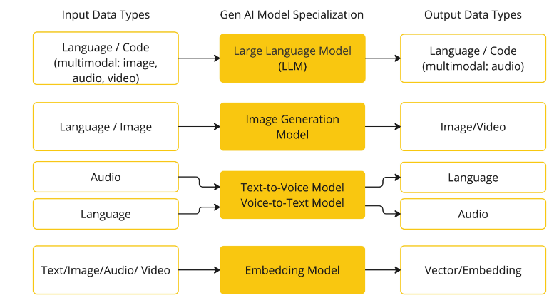
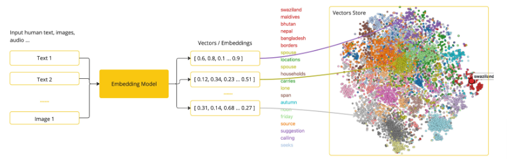
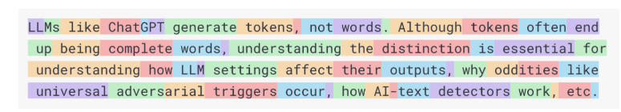
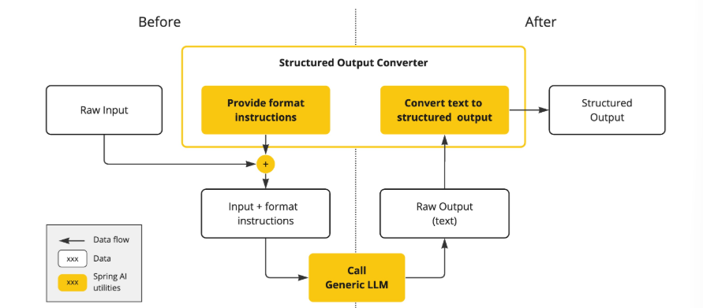
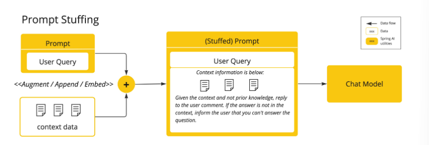
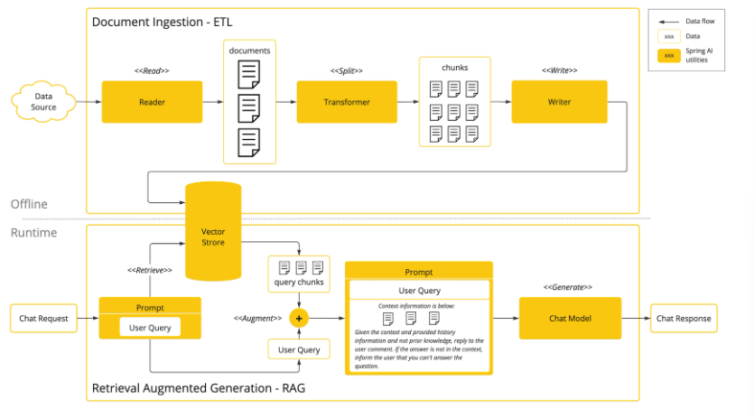
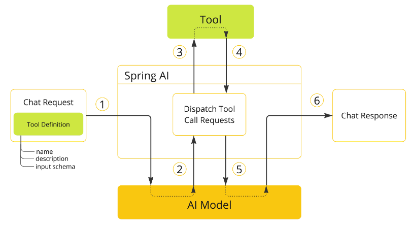

## AI 概念

### 概述

本节描述了 Spring AI 使用的核心概念。我们建议您仔细阅读，以理解 Spring AI 实现背后的思想。

### 模型

AI 模型是旨在处理和生成信息的算法，通常模仿人类的认知功能。通过从大型数据集中学习模式和洞察，这些模型可以进行预测、生成文本、图像或其他输出，从而增强各行各业的各种应用。

有许多不同类型的 AI 模型，每种模型都适用于特定的用例。虽然 ChatGPT 及其生成式 AI 功能通过文本输入和输出吸引了用户，但许多模型和公司提供多样化的输入和输出。在 ChatGPT 之前，许多人着迷于文本到图像生成模型，例如 Midjourney 和 Stable Diffusion。



Spring AI 目前支持处理语言、图像和音频输入输出的模型。接受文本输入并输出数字（文本嵌入）代表 AI 模型内部的数据结构。Spring AI 支持嵌入功能以实现更高级的用例。

像 GPT 这样的模型的独特之处在于其预训练特性，正如 GPT 中的 "P" 所示——Chat Generative Pre-trained Transformer。这一预训练特性使 AI 成为通用开发工具，无需深厚的机器学习或模型训练背景。

### 提示

提示是基于语言的输入的基础，它指导 AI 模型产生特定的输出。对于熟悉 ChatGPT 的人来说，提示可能仅仅是输入到对话框中并发送到 API 的文本。然而，它包含的内容远不止于此。

在许多 AI 模型中，提示的文本不仅仅是一个简单的字符串。ChatGPT 的 API 在一个提示中有多个文本输入，每个文本输入都被分配了一个角色。例如，有 `system` 角色，用于告诉模型如何表现并设置交互的上下文。还有 `user` 角色，通常是用户的输入。

编写有效提示既是一门艺术，也是一门科学。ChatGPT 设计用于人类对话，这与使用 SQL "提问" 有很大不同。与 AI 模型交流更像是与另一个人对话。正因如此，"提示工程"成为了一个独立的学科。现在有大量提升提示有效性的技术。投入时间优化提示可以极大提升输出质量。

分享提示已成为一种社区实践，并且有大量学术研究。例如，一项最新论文发现最有效的提示之一是以"请深呼吸，逐步思考"开头。这说明了语言的重要性。我们尚未完全理解如何最有效地利用前几代技术(如 ChatGPT 3.5)，更不用说正在开发的新版本了。

### 提示模板

创建有效提示需要建立请求上下文，并用用户输入的特定值替换部分内容。这个过程使用传统的基于文本的模板引擎来创建和管理提示。Spring AI 使用 OSS 库 StringTemplate 实现这一功能。

例如，简单的提示模板:

```
Tell me a {adjective} joke about {content}.
```

在 Spring AI 中，提示模板类似于 Spring MVC 架构中的 "View"。通常会提供一个 `java.util.Map` 类型的模型对象来填充模板中的占位符。"渲染" 后的字符串就是提供给 AI 模型的提示内容。

实际发送给模型的提示数据格式有很大差异。最初只是简单字符串，后来演变为包含多条消息，每条消息中的字符串代表模型的不同角色。

### 嵌入

嵌入是文本、图像或视频的数值表示，用于捕捉输入之间的关系。嵌入通过将文本、图像和视频转换为浮点数数组(向量)来工作。这些向量旨在捕捉文本、图像和视频的含义。嵌入数组的长度称为向量的维度。

通过计算两个文本的向量表示之间的数值距离，应用程序可以判断生成嵌入向量的对象之间的相似性。



作为 Java 开发者探索 AI，无需理解这些向量表示背后的复杂数学理论或具体实现。只需了解它们在 AI 系统中的作用和功能，尤其是在集成 AI 功能时。

嵌入在诸如检索增强生成(RAG)等实际应用中尤为重要。它们使数据能够作为语义空间中的点进行表示，这类似于欧几里得几何的二维空间，但维度更高。这意味着，就像欧几里得几何中点的距离反映坐标的接近程度一样，在语义空间中，点的接近程度反映了含义的相似性。关于相似主题的句子会在这个多维空间中靠得更近，就像图上的点彼此接近一样。这种接近性有助于文本分类、语义搜索甚至产品推荐等任务，因为它允许 AI 根据"位置"来区分和分组相关概念。

你可以将这个语义空间看作一个向量。

### Token

Token 是 AI 模型工作的基本单元。输入时，模型将单词转换为 token;输出时，再将 token 转换为单词。

在英语中，一个 token 大约对应 0.75 个单词。例如，莎士比亚全集约 90 万词，对应约 120 万个 token。



更重要的是，Token = 金钱。在托管 AI 模型的场景下，费用由 token 数量决定，输入和输出都会计入总 token 数。

此外，模型有 token 限制，限制了单次 API 调用可处理的文本量，这通常称为"上下文窗口"。超出该限制的文本不会被模型处理。

例如，ChatGPT3 的 token 限制为 4K，GPT4 有 8K、16K、32K 等不同选项。Anthropic 的 Claude AI 模型有 10 万 token 限制，Meta 的最新研究模型甚至达到 100 万 token。

如果要用 GPT4 总结莎士比亚全集，需要采用软件工程手段将数据切分，并在模型的上下文窗口内呈现。Spring AI 项目可帮助您完成这项任务。

### 结构化输出

AI 模型的输出传统上是 `java.lang.String`，即使你要求返回 JSON，也只是字符串而不是 JSON 数据结构。并且在提示中要求"返回 JSON"并不总是 100% 有效。

这导致了一个专门领域的出现，即通过精心设计的提示获得期望输出，然后将结果字符串转换为可用的数据结构以便应用集成。



结构化输出转换采用精心设计的提示，通常需要多次与模型交互以获得理想格式。

### 向 AI 模型引入你的数据和 API

如何让 AI 模型获取其未训练过的信息?

注意，GPT 3.5/4.0 的数据集只到 2021 年 9 月。因此，模型对之后的信息会说不知道。这个数据集大约有 650GB。

有三种方法可以让 AI 模型结合你的数据:

1. **微调(Fine Tuning)**：传统机器学习方法，通过调整模型内部权重来定制模型。但对于 GPT 这样的大模型，这一过程非常复杂且资源消耗极大，并且部分模型不支持微调。

2. **提示填充(Prompt Stuffing)**：更实用的方法是将你的数据嵌入到提示中。由于模型有 token 限制，需要采用技术手段在上下文窗口内呈现相关数据。这种方式俗称"stuffing the prompt"。Spring AI 库帮助你实现基于"stuffing the prompt"的方案，也称为检索增强生成(RAG)。
  


3. **工具调用(Tool Calling)**：该方法允许注册工具(用户自定义服务)，将大语言模型与外部系统 API 连接。Spring AI 极大简化了工具调用相关代码。

### 检索增强生成(RAG)

检索增强生成(RAG)技术用于将相关数据纳入提示，以提升 AI 回答的准确性。

该方法采用批处理风格的编程模型，作业从文档中读取非结构化数据，转换后写入向量数据库。从高层看，这是一个 ETL(抽取、转换、加载)流程。向量数据库用于 RAG 技术中的检索环节。

在将非结构化数据加载到向量数据库时，最重要的转换之一是将原始文档拆分为更小的片段。拆分过程有两个关键步骤:

1. 在保留内容语义边界的前提下拆分文档。例如，带有段落和表格的文档应避免在段落或表格中间拆分;代码应避免在方法实现中间拆分。
2. 进一步将文档片段拆分为仅占 AI 模型 token 限制一小部分的更小片段。

RAG 的下一阶段是处理用户输入。当用户提问时，问题和所有"相似"的文档片段会被放入发送给 AI 模型的提示中。这就是使用向量数据库的原因——它非常擅长查找相似内容。



- ETL 流水线介绍了如何编排数据提取、转换和存储到结构化向量库的流程，确保数据以最佳格式供 AI 检索。
- ChatClient - RAG 介绍了如何使用 QuestionAnswerAdvisor 实现 RAG 能力。

### 工具调用(Tool Calling)

大语言模型(LLM)训练后被冻结，知识会过时，且无法访问或修改外部数据。工具调用机制解决了这些问题。它允许你注册自己的服务作为工具，将大语言模型与外部系统 API 连接。这些系统可以为 LLM 提供实时数据并代表其执行数据处理。

Spring AI 极大简化了工具调用相关代码。它会自动处理工具调用对话。你可以通过 @Tool 注解方法并在提示选项中提供，使其对模型可用。此外，可以在单个提示中定义和引用多个工具。



1. 需要让模型可用某个工具时，在聊天请求中包含其定义。每个工具定义包括名称、描述和输入参数的 schema。
2. 当模型决定调用工具时，会返回工具名和按 schema 构造的输入参数。
3. 应用负责根据工具名识别并执行工具，并传入参数。
4. 工具调用结果由应用处理。
5. 应用将工具调用结果返回给模型。
6. 模型用工具调用结果作为额外上下文生成最终回复。

更多用法请参考工具调用文档。

### 评估 AI 响应

有效评估 AI 系统对用户请求的输出对于确保最终应用的准确性和实用性非常重要。现在有多种新技术可以利用预训练模型本身进行评估。

评估过程包括分析生成的回复是否符合用户意图和查询上下文。相关性、一致性和事实正确性等指标用于衡量 AI 回复的质量。

一种方法是将用户请求和 AI 回复一并提交给模型，询问回复是否与数据一致。此外，利用向量数据库中存储的信息作为补充数据，也有助于判断回复的相关性。

Spring AI 项目提供了 Evaluator API，目前支持基础的模型回复评估策略。更多信息请参考评测测试文档。