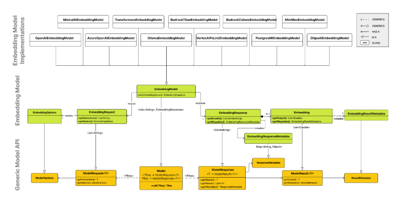

## 嵌入模型 API

### 概述

嵌入是文本、图像或视频的数值表示，用于捕获输入之间的关系。嵌入通过将文本、图像和视频转换为浮点数数组（称为向量）来工作。这些向量旨在捕获文本、图像和视频的含义。嵌入数组的长度称为向量的维度。

通过计算两段文本的向量表示之间的数值距离，应用程序可以确定用于生成嵌入向量的对象之间的相似性。

`EmbeddingModel` 接口设计用于与 AI 和机器学习中的嵌入模型进行直接集成。它的主要功能是将文本转换为数值向量，通常称为嵌入。这些嵌入对于语义分析和文本分类等各种任务至关重要。

`EmbeddingModel` 接口的设计围绕两个主要目标：

- **可移植性**：此接口确保在各种嵌入模型之间轻松适应。它允许开发人员在不同嵌入技术或模型之间切换，只需最少的代码更改。这种设计与 Spring 的模块化和可互换性理念保持一致。
- **简单性**：EmbeddingModel 简化了将文本转换为嵌入的过程。通过提供像 `embed(String text)` 和 `embed(Document document)` 这样的直接方法，它消除了处理原始文本数据和嵌入算法的复杂性。这种设计选择使开发人员（特别是 AI 新手）能够在其应用程序中使用嵌入，而无需深入了解底层机制。

### API 概述

嵌入模型 API 构建在通用 Spring AI Model API 之上，这是 Spring AI 库的一部分。因此，`EmbeddingModel` 接口扩展了 `Model` 接口，该接口提供了一组用于与 AI 模型交互的标准方法。`EmbeddingRequest` 和 `EmbeddingResponse` 类从 `ModelRequest` 和 `ModelResponse` 扩展而来，分别用于封装嵌入模型的输入和输出。

嵌入 API 又被更高级别的组件用来实现特定嵌入模型的嵌入模型，如 OpenAI、Titan、Azure OpenAI、Ollie 等。

下图说明了嵌入 API 及其与 Spring AI Model API 和嵌入模型的关系：



### EmbeddingModel

#### 接口定义

```java
public interface EmbeddingModel extends Model<EmbeddingRequest, EmbeddingResponse> {

    @Override
    EmbeddingResponse call(EmbeddingRequest request);

    /**
     * 将给定文档的内容嵌入到向量中。
     * @param document 要嵌入的文档。
     * @return 嵌入的向量。
     */
    float[] embed(Document document);

    /**
     * 将给定文本嵌入到向量中。
     * @param text 要嵌入的文本。
     * @return 嵌入的向量。
     */
    default float[] embed(String text) {
        Assert.notNull(text, "Text must not be null");
        return this.embed(List.of(text)).iterator().next();
    }

    /**
     * 将一批文本嵌入到向量中。
     * @param texts 要嵌入的文本列表。
     * @return 嵌入向量列表的列表。
     */
    default List<float[]> embed(List<String> texts) {
        Assert.notNull(texts, "Texts must not be null");
        return this.call(new EmbeddingRequest(texts, EmbeddingOptions.EMPTY))
            .getResults()
            .stream()
            .map(Embedding::getOutput)
            .toList();
    }

    /**
     * 将一批文本嵌入到向量中并返回 {@link EmbeddingResponse}。
     * @param texts 要嵌入的文本列表。
     * @return 嵌入响应。
     */
    default EmbeddingResponse embedForResponse(List<String> texts) {
        Assert.notNull(texts, "Texts must not be null");
        return this.call(new EmbeddingRequest(texts, EmbeddingOptions.EMPTY));
    }

    /**
     * @return 嵌入向量的维度数。它是生成特定的。
     */
    default int dimensions() {
        return embed("Test String").size();
    }

}
```

#### 方法说明

- `embed` 方法提供了各种将文本转换为嵌入的选项，适应单个字符串、结构化 `Document` 对象或文本批次。
- 提供了多个用于嵌入文本的快捷方法，包括 `embed(String text)` 方法，它接受单个字符串并返回相应的嵌入向量。所有快捷方法都是围绕 `call` 方法实现的，这是调用嵌入模型的主要方法。
- 通常嵌入返回浮点数列表，以数值向量格式表示嵌入。
- `embedForResponse` 方法提供了更全面的输出，可能包括有关嵌入的附加信息。
- `dimensions` 方法是开发人员快速确定嵌入向量大小的便捷工具，这对于理解嵌入空间和后续处理步骤很重要。

### EmbeddingRequest

`EmbeddingRequest` 是一个 `ModelRequest`，它接受文本对象列表和可选的嵌入请求选项。以下是 `EmbeddingRequest` 类的截断版本：

```java
public class EmbeddingRequest implements ModelRequest<List<String>> {
    private final List<String> inputs;
    private final EmbeddingOptions options;
    // 其他方法省略
}
```

### EmbeddingResponse

`EmbeddingResponse` 类的结构如下：

```java
public class EmbeddingResponse implements ModelResponse<Embedding> {

    private List<Embedding> embeddings;
    private EmbeddingResponseMetadata metadata = new EmbeddingResponseMetadata();
    // 其他方法省略
}
```

`EmbeddingResponse` 类保存 AI 模型的输出，每个 `Embedding` 实例包含来自单个文本输入的结果向量数据。`EmbeddingResponse` 类还携带有关 AI 模型响应的 `EmbeddingResponseMetadata` 元数据。

### Embedding

`Embedding` 表示单个嵌入向量：

```java
public class Embedding implements ModelResult<float[]> {
    private float[] embedding;
    private Integer index;
    private EmbeddingResultMetadata metadata;
    // 其他方法省略
}
```

### 可用实现

在内部，各种 `EmbeddingModel` 实现使用不同的低级库和 API 来执行嵌入任务。以下是 `EmbeddingModel` 实现的一些可用实现：

- Spring AI OpenAI 嵌入
- Spring AI Azure OpenAI 嵌入
- Spring AI Ollama 嵌入
- Spring AI Transformers (ONNX) 嵌入
- Spring AI PostgresML 嵌入
- Spring AI Bedrock Cohere 嵌入
- Spring AI Bedrock Titan 嵌入
- Spring AI VertexAI 嵌入
- Spring AI Mistral AI 嵌入
- Spring AI Oracle Cloud Infrastructure GenAI 嵌入
