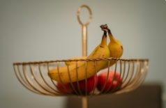

## 多模态 API

> "所有自然相关的事物都应该组合在一起教授" - John Amos Comenius, "Orbis Sensualium Pictus", 1658

人类同时通过多种数据输入模式处理知识。我们的学习方式和经验都是多模态的。我们不仅仅有视觉、音频和文本。

与此相反，机器学习往往专注于处理单一模态的专门模型。例如，我们开发了用于文本到语音或语音到文本等任务的音频模型，以及用于对象检测和分类等任务的计算机视觉模型。

然而，新一代的多模态大型语言模型开始出现。例如，OpenAI 的 GPT-4o、Google 的 Vertex AI Gemini 1.5、Anthropic 的 Claude3，以及开源产品 Llama3.2、LLaVA 和 BakLLaVA 都能够接受多种输入，包括文本图像、音频和视频，并通过整合这些输入生成文本响应。

**注意**：多模态大型语言模型（LLM）功能使模型能够处理文本并结合其他模态（如图像、音频或视频）生成文本。

### Spring AI 多模态

多模态指的是模型同时理解和处理来自各种来源信息的能力，包括文本、图像、音频和其他数据格式。

Spring AI Message API 提供了支持多模态 LLM 所需的所有抽象。


UserMessage 的 `content` 字段主要用于文本输入，而可选的 `media` 字段允许添加一个或多个不同模态的额外内容，如图像、音频和视频。`MimeType` 指定模态类型。根据使用的 LLM，`Media` 数据字段可以是作为 `Resource` 对象的原始媒体内容，也可以是内容的 `URI`。

**注意**：media 字段目前仅适用于用户输入消息（例如，`UserMessage`）。它对系统消息没有意义。包含 LLM 响应的 `AssistantMessage` 仅提供文本内容。要生成非文本媒体输出，您应该使用专门的单模态模型之一。

例如，我们可以将图片作为输入，并要求 LLM 解释它看到的内容。对于大多数多模态 LLM，Spring AI 代码看起来像这样：



对于大多数多模态 LLM，Spring AI 代码看起来像这样：

```java
var imageResource = new ClassPathResource("/multimodal.test.png");

var userMessage = new UserMessage(
    "解释你在这张图片中看到了什么？", // content
    new Media(MimeTypeUtils.IMAGE_PNG, this.imageResource)); // media

ChatResponse response = chatModel.call(new Prompt(this.userMessage));
```

或者使用流畅的 ChatClient API：

```java
String response = ChatClient.create(chatModel).prompt()
        .user(u -> u.text("解释你在这张图片上看到了什么？")
                    .media(MimeTypeUtils.IMAGE_PNG, new ClassPathResource("/multimodal.test.png")))
        .call()
        .content();
```

并产生如下响应：

> 这是一张水果碗的图片，设计简单。碗由金属制成，带有弯曲的金属丝边缘，形成开放式结构，使水果可以从各个角度看到。碗内有两个黄色香蕉放在一个红色苹果上面。香蕉略微过熟，从香蕉皮上的棕色斑点可以看出。碗顶部有一个金属环，可能用作携带的把手。碗放在一个平面上，背景为中性色，可以清晰地看到里面的水果。

### 支持的多模态模型

Spring AI 为以下聊天模型提供多模态支持：

- Anthropic Claude 3
- AWS Bedrock Converse
- Azure Open AI（例如 GPT-4o 模型）
- Mistral AI（例如 Mistral Pixtral 模型）
- Ollama（例如 LLaVA、BakLLaVA、Llama3.2 模型）
- OpenAI（例如 GPT-4 和 GPT-4o 模型）
- Vertex AI Gemini（例如 gemini-1.5-pro-001、gemini-1.5-flash-001 模型）
