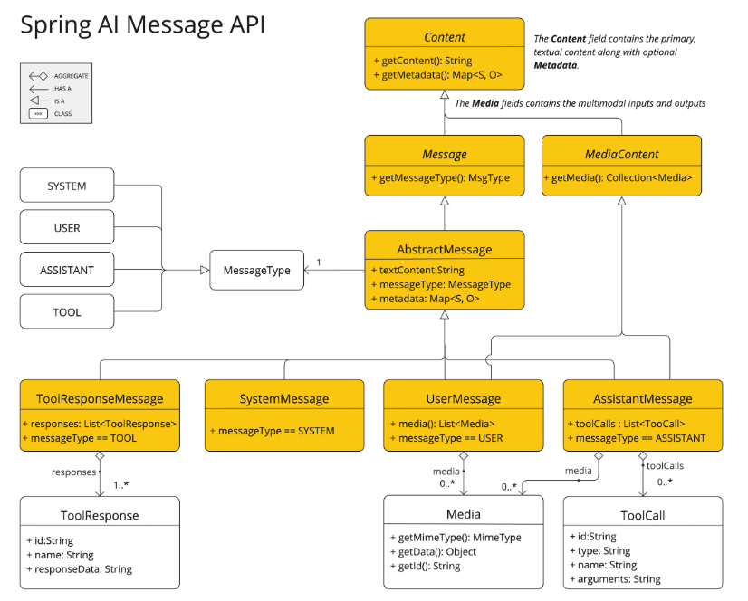

## 提示词

提示词是引导 AI 模型生成特定输出的输入。这些提示词的设计和措辞会显著影响模型的响应。

在 Spring AI 中与 AI 模型交互的最低级别，处理提示词的方式与 Spring MVC 中管理"视图"有些相似。这涉及创建包含动态内容占位符的广泛文本。然后根据用户请求或应用程序中的其他代码替换这些占位符。另一个类比是包含某些表达式占位符的 SQL 语句。

随着 Spring AI 的发展，它将引入更高级别的 AI 模型交互抽象。本节中描述的基础类可以类比于 JDBC 的角色和功能。例如，`ChatModel` 类类似于 JDK 中的核心 JDBC 库。`ChatClient` 类可以类比于 `JdbcClient`，它构建在 `ChatModel` 之上，并通过 `Advisor` 提供更高级的构造，以考虑与模型的过去交互，用额外的上下文文档增强提示词，并引入代理行为。

提示词的结构在 AI 领域内随着时间不断发展。最初，提示词是简单的字符串。随着时间的推移，它们开始包含特定输入的占位符，如 AI 模型识别的"USER:"。OpenAI 通过将多个消息字符串分类为不同的角色，在 AI 模型处理之前，为提示词引入了更多结构。

### API 概述

#### Prompt

通常使用 `ChatModel` 的 `call()` 方法，该方法接受 `Prompt` 实例并返回 `ChatResponse`。

`Prompt` 类作为一系列组织好的 `Message` 对象和请求 `ChatOptions` 的容器。每个 `Message` 在提示词中体现一个独特的角色，其内容和意图各不相同。这些角色可以包含各种元素，从用户查询到 AI 生成的响应再到相关背景信息。这种安排使与 AI 模型的交互变得复杂和详细，因为提示词由多个消息构建，每个消息都被分配了特定的对话角色。

以下是 `Prompt` 类的截断版本，为简洁起见省略了构造函数和实用方法：

```java
public class Prompt implements ModelRequest<List<Message>> {

    private final List<Message> messages;

    private ChatOptions chatOptions;
}
```

#### Message

`Message` 接口封装了 `Prompt` 文本内容、元数据属性集合和称为 `MessageType` 的分类。

接口定义如下：

```java
public interface Content {

    String getContent();

    Map<String, Object> getMetadata();
}

public interface Message extends Content {

    MessageType getMessageType();
}
```

多模态消息类型还实现了 `MediaContent` 接口，提供 `Media` 内容对象列表。

```java
public interface MediaContent extends Content {

    Collection<Media> getMedia();

}
```

`Message` 接口的各种实现对应于 AI 模型可以处理的不同类别的消息。模型根据对话角色区分消息类别。



这些角色通过 `MessageType` 有效地映射，如下所述。

#### 角色

每个消息都被分配一个特定的角色。这些角色对消息进行分类，为 AI 模型阐明提示词每个部分的上下文和目的。这种结构化方法增强了与 AI 交流的细微差别和有效性，因为提示词的每个部分在交互中都扮演着独特和定义明确的角色。

主要角色包括：

- **系统角色**：指导 AI 的行为和响应风格，设置 AI 如何解释和回复输入的参数或规则。这就像在开始对话之前向 AI 提供指令。
- **用户角色**：表示用户的输入 - 他们的问题、命令或对 AI 的陈述。这个角色是基础性的，因为它构成了 AI 响应的基础。
- **助手角色**：AI 对用户输入的响应。不仅仅是答案或反应，它对于维持对话流程至关重要。通过跟踪 AI 的先前响应（其"助手角色"消息），系统确保连贯和上下文相关的交互。助手消息可能还包含函数工具调用请求信息。这就像 AI 中的一个特殊功能，在需要时用于执行特定功能，如计算、获取数据或其他超出简单对话的任务。
- **工具/函数角色**：工具/函数角色专注于返回响应工具调用助手消息的额外信息。

角色在 Spring AI 中表示为枚举，如下所示：

```java
public enum MessageType {

    USER("user"),

    ASSISTANT("assistant"),

    SYSTEM("system"),

    TOOL("tool");

    ...
}
```

### PromptTemplate

Spring AI 中提示词模板化的关键组件是 `PromptTemplate` 类，旨在促进创建结构化提示词，然后发送给 AI 模型进行处理。

```java
public class PromptTemplate implements PromptTemplateActions, PromptTemplateMessageActions {

    // 其他方法将在后面讨论
}
```

这个类使用 `TemplateRenderer` API 来渲染模板。默认情况下，Spring AI 使用 `StTemplateRenderer` 实现，它基于 Terence Parr 开发的开源 StringTemplate 引擎。模板变量由 `{}` 语法标识，但您也可以配置分隔符以使用其他语法。

```java
public interface TemplateRenderer extends BiFunction<String, Map<String, Object>, String> {

    @Override
    String apply(String template, Map<String, Object> variables);

}
```

Spring AI 使用 `TemplateRenderer` 接口来处理将变量替换到模板字符串中的实际工作。默认实现使用 `StringTemplate`。如果需要自定义逻辑，您可以提供自己的 `TemplateRenderer` 实现。对于不需要模板渲染的场景（例如，模板字符串已经完整），您可以使用提供的 `NoOpTemplateRenderer`。

#### 使用带有 '<' 和 '>' 分隔符的自定义 StringTemplate 渲染器的示例

```java
PromptTemplate promptTemplate = PromptTemplate.builder()
    .renderer(StTemplateRenderer.builder().startDelimiterToken('<').endDelimiterToken('>').build())
    .template("""
            告诉我 5 部由 <composer> 作曲的电影名称。
            """)
    .build();

String prompt = promptTemplate.render(Map.of("composer", "John Williams"));
```

这个类实现的接口支持提示词创建的不同方面：

- `PromptTemplateStringActions` 专注于创建和渲染提示词字符串，代表最基本的提示词生成形式。
- `PromptTemplateMessageActions` 专门用于通过生成和操作 `Message` 对象来创建提示词。
- `PromptTemplateActions` 设计用于返回 `Prompt` 对象，可以传递给 `ChatModel` 以生成响应。

虽然这些接口在许多项目中可能不会广泛使用，但它们展示了提示词创建的不同方法。

##### 实现的接口是：

```java
public interface PromptTemplateStringActions {

    String render();

    String render(Map<String, Object> model);

}
```

- 方法 `String render()`：将提示词模板渲染成最终字符串格式，无需外部输入，适用于没有占位符或动态内容的模板。
- 方法 `String render(Map<String, Object> model)`：增强渲染功能以包含动态内容。它使用 `Map<String, Object>`，其中映射键是提示词模板中的占位符名称，值是待插入的动态内容。

```java
public interface PromptTemplateMessageActions {

    Message createMessage();

    Message createMessage(List<Media> mediaList);

    Message createMessage(Map<String, Object> model);

}
```

- 方法 `Message createMessage()`：创建没有额外数据的 `Message` 对象，用于静态或预定义的消息内容。
- 方法 `Message createMessage(List<Media> mediaList)`：创建具有静态文本和媒体内容的 `Message` 对象。
- 方法 `Message createMessage(Map<String, Object> model)`：扩展消息创建以集成动态内容，接受 `Map<String, Object>`，其中每个条目代表消息模板中的占位符及其对应的动态值。

```java
public interface PromptTemplateActions extends PromptTemplateStringActions {

    Prompt create();

    Prompt create(ChatOptions modelOptions);

    Prompt create(Map<String, Object> model);

    Prompt create(Map<String, Object> model, ChatOptions modelOptions);

}
```

- 方法 `Prompt create()`：生成没有外部数据输入的 `Prompt` 对象，适用于静态或预定义的提示词。
- 方法 `Prompt create(ChatOptions modelOptions)`：生成没有外部数据输入且具有特定聊天请求选项的 `Prompt` 对象。
- 方法 `Prompt create(Map<String, Object> model)`：扩展提示词创建功能以包含动态内容，接受 `Map<String, Object>`，其中每个映射条目是提示词模板中的占位符及其关联的动态值。
- 方法 `Prompt create(Map<String, Object> model, ChatOptions modelOptions)`：扩展提示词创建功能以包含动态内容，接受 `Map<String, Object>`，其中每个映射条目是提示词模板中的占位符及其关联的动态值，以及聊天请求的特定选项。

### 使用示例

下面是一个来自 AI Workshop on PromptTemplates 的简单示例。

```java
PromptTemplate promptTemplate = new PromptTemplate("告诉我一个关于 {topic} 的 {adjective} 笑话");

Prompt prompt = promptTemplate.create(Map.of("adjective", adjective, "topic", topic));

return chatModel.call(prompt).getResult();
```

另一个来自 AI Workshop on Roles 的示例如下所示。

```java
String userText = """
    告诉我关于黄金时代海盗时期的三位著名海盗以及他们的事迹。
    为每个海盗至少写一句话。
    """;

Message userMessage = new UserMessage(userText);

String systemText = """
  你是一个帮助人们查找信息的 AI 助手。
  你的名字是 {name}
  你应该用你的名字回复用户的请求，并且用 {voice} 的风格。
  """;

SystemPromptTemplate systemPromptTemplate = new SystemPromptTemplate(systemText);
Message systemMessage = systemPromptTemplate.createMessage(Map.of("name", name, "voice", voice));

Prompt prompt = new Prompt(List.of(userMessage, systemMessage));

List<Generation> response = chatModel.call(prompt).getResults();
```

这展示了如何使用 `SystemPromptTemplate` 创建一个带有系统角色的 `Message`，并传入占位符值。然后，带有 `user` 角色的消息与带有 `system` 角色的消息组合形成提示词。然后将提示词传递给 ChatModel 以获取生成响应。

#### 使用自定义模板渲染器

您可以通过实现 `TemplateRenderer` 接口并将其传递给 `PromptTemplate` 构造函数来使用自定义模板渲染器。您也可以继续使用默认的 `StTemplateRenderer`，但使用自定义配置。

默认情况下，模板变量由 `{}` 语法标识。如果您计划在提示词中包含 JSON，您可能希望使用不同的语法以避免与 JSON 语法冲突。例如，您可以使用 `<` 和 `>` 分隔符。

```java
PromptTemplate promptTemplate = PromptTemplate.builder()
    .renderer(StTemplateRenderer.builder().startDelimiterToken('<').endDelimiterToken('>').build())
    .template("""
            告诉我 5 部由 <composer> 作曲的电影名称。
            """)
    .build();

String prompt = promptTemplate.render(Map.of("composer", "John Williams"));
```

#### 使用资源而不是原始字符串

Spring AI 支持 `org.springframework.core.io.Resource` 抽象，因此您可以将提示词数据放在可以直接在 `PromptTemplate` 中使用的文件中。例如，您可以在 Spring 管理的组件中定义一个字段来检索 `Resource`。

```java
@Value("classpath:/prompts/system-message.st")
private Resource systemResource;
```

然后直接将该资源传递给 `SystemPromptTemplate`。

```java
SystemPromptTemplate systemPromptTemplate = new SystemPromptTemplate(systemResource);
```

### 提示词工程

在生成式 AI 中，创建提示词是开发人员的关键任务。这些提示词的质量和结构会显著影响 AI 输出的有效性。投入时间和精力设计周到的提示词可以大大提高 AI 的结果。

在 AI 社区中，分享和讨论提示词是一种常见做法。这种协作方法不仅创造了共享学习环境，还导致识别和使用高效的提示词。

这个领域的研究通常涉及分析和比较不同的提示词，以评估它们在不同情况下的有效性。例如，一项重要研究表明，以"深呼吸，一步一步地解决这个问题"开始提示词显著提高了问题解决效率。这突出了精心选择的语言对生成式 AI 系统性能的影响。

随着 AI 技术的快速发展，掌握提示词的最有效使用是一个持续的挑战。您应该认识到提示词工程的重要性，并考虑使用来自社区和研究的见解来改进提示词创建策略。

#### 创建有效的提示词

在开发提示词时，整合几个关键组件以确保清晰和有效性很重要：

- **指令**：向 AI 提供清晰直接的指令，就像您与人交流一样。这种清晰度对于帮助 AI"理解"期望的内容至关重要。
- **外部上下文**：在必要时包含相关背景信息或 AI 响应的具体指导。这种"外部上下文"为提示词提供框架，帮助 AI 理解整体情况。
- **用户输入**：这是直接的部分 - 用户的直接请求或问题构成提示词的核心。
- **输出指示器**：这方面可能很棘手。它涉及指定 AI 响应的所需格式，如 JSON。但是，请注意 AI 可能并不总是严格遵循这种格式。例如，它可能在实际 JSON 数据之前添加"这是您的 JSON"这样的短语，或者有时生成不准确的类 JSON 结构。

在创建提示词时，为 AI 提供预期问答格式的示例可能非常有益。这种做法帮助 AI"理解"您的查询的结构和意图，从而产生更精确和相关的响应。虽然本文档没有深入探讨这些技术，但它们为 AI 提示词工程的进一步探索提供了起点。

以下是进一步研究的资源列表。

##### 简单技术

- **文本摘要**：将大量文本缩减为简洁的摘要，捕捉关键点和主要思想，同时省略不太重要的细节。
- **问答**：专注于从提供的文本中得出特定答案，基于用户提出的问题。它是关于根据查询精确定位和提取相关信息。
- **文本分类**：系统地将文本分类到预定义的类别或组中，分析文本并根据其内容将其分配到最合适的类别。
- **对话**：创建交互式对话，使 AI 能够与用户进行来回交流，模拟自然对话流程。
- **代码生成**：根据特定的用户需求或描述生成功能代码片段，将自然语言指令转换为可执行代码。

##### 高级技术

- **零样本、少样本学习**：使模型能够用最少或没有特定问题类型的先验示例做出准确的预测或响应，使用学习的泛化来理解和处理新任务。
- **思维链**：链接多个 AI 响应以创建连贯和上下文感知的对话。它帮助 AI 保持讨论的线索，确保相关性和连续性。
- **ReAct（推理+行动）**：在这种方法中，AI 首先分析（推理）输入，然后确定最适当的行动或响应。它结合了理解和决策。

##### Microsoft 指南

- **提示词创建和优化框架**：Microsoft 提供了一种结构化的方法来开发和优化提示词。这个框架指导用户创建有效的提示词，从 AI 模型中引出所需的响应，优化交互以实现清晰和效率。

### 令牌

令牌在 AI 模型处理文本的方式中至关重要，作为将单词（如我们所理解的）转换为 AI 模型可以处理的格式的桥梁。这种转换发生在两个阶段：单词在输入时转换为令牌，然后这些令牌在输出时转换回单词。

令牌化，即将文本分解为令牌的过程，是 AI 模型理解和处理语言的基础。AI 模型使用这种令牌化格式来理解和响应提示词。

为了更好地理解令牌，可以将它们视为单词的部分。通常，一个令牌代表大约四分之三个单词。例如，莎士比亚的完整作品，总计约 90 万字，将转换为约 120 万个令牌。

使用 OpenAI Tokenizer UI 来实验单词如何转换为令牌。

令牌除了在 AI 处理中的技术作用外，还具有实际意义，特别是在计费和模型能力方面：

- **计费**：AI 模型服务通常基于令牌使用量计费。输入（提示词）和输出（响应）都计入总令牌数，使较短的提示词更具成本效益。
- **模型限制**：不同的 AI 模型有不同的令牌限制，定义它们的"上下文窗口" - 它们一次可以处理的最大信息量。例如，GPT-3 的限制是 4K 令牌，而其他模型如 Claude 2 和 Meta Llama 2 的限制是 100K 令牌，一些研究模型可以处理多达 100 万个令牌。
- **上下文窗口**：模型的令牌限制决定了其上下文窗口。超过此限制的输入不会被模型处理。只发送处理所需的最小有效信息集至关重要。例如，当询问"哈姆雷特"时，不需要包含莎士比亚所有其他作品的令牌。
- **响应元数据**：AI 模型响应的元数据包括使用的令牌数，这是管理使用量和成本的重要信息。
