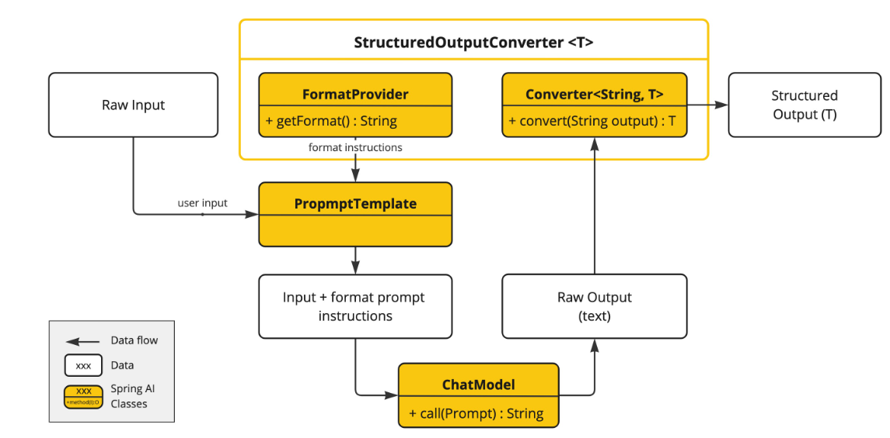

## 结构化输出转换器

### 概述

> **注意**: 截至 2024年2月5日，旧的 `OutputParser`、`BeanOutputParser`、`ListOutputParser` 和 `MapOutputParser` 类已被弃用，取而代之的是新的 `StructuredOutputConverter`、`BeanOutputConverter`、`ListOutputConverter` 和 `MapOutputConverter` 实现。后者是前者的直接替代品，提供相同的功能。变更的主要原因是为了命名，因为实际上并没有进行任何解析操作，同时也与 Spring 的 `org.springframework.core.convert.converter` 包保持一致，带来了一些改进的功能。

LLM 生成结构化输出的能力对于依赖可靠解析输出值的下游应用程序来说非常重要。开发人员希望快速将 AI 模型的结果转换为可以传递给其他应用程序函数和方法的数据类型，如 JSON、XML 或 Java 类。

Spring AI 的 **Structured Output Converters** 帮助将 LLM 输出转换为结构化格式。

如下图所示，这种方法围绕 LLM 文本补全端点运行：使用通用补全 API 从大型语言模型 (LLM) 生成结构化输出需要仔细处理输入和输出。结构化输出转换器在 LLM 调用前后都扮演着关键角色，确保实现所需的输出结构。


在 LLM 调用之前，转换器将格式指令附加到提示中，为模型提供明确的指导，以生成所需的输出结构。这些指令作为蓝图，塑造模型的响应以符合指定的格式。

在 LLM 调用之后，转换器获取模型的输出文本并将其转换为结构化类型的实例。这个转换过程涉及解析原始文本输出并将其映射到相应的结构化数据表示，如 JSON、XML 或特定领域的数据结构。

> **提示**: `StructuredOutputConverter` 是尽最大努力将模型输出转换为结构化输出。AI 模型不能保证按照要求返回结构化输出。模型可能不理解提示或无法按要求生成结构化输出。考虑实现验证机制以确保模型输出符合预期。

> **提示**: `StructuredOutputConverter` 不用于 LLM 工具调用，因为此功能默认就提供结构化输出。

### 结构化输出 API

`StructuredOutputConverter` 接口允许您从基于文本的 AI 模型输出中获取结构化输出，例如将输出映射到 Java 类或值数组。

接口定义如下：

```java
public interface StructuredOutputConverter<T> extends Converter<String, T>, FormatProvider {
}
```

它结合了 `Spring Converter<String, T>` 接口和 `FormatProvider` 接口

```java
public interface FormatProvider { 
    String getFormat();
}
```

下图显示了使用结构化输出 API 时的数据流。



`FormatProvider` 为 AI 模型提供特定的格式指南，使其能够生成可以转换为指定目标类型 T 的文本输出。以下是此类格式指令的示例：

> 您的响应应该是 JSON 格式。
> JSON 的数据结构应该匹配这个 Java 类:java.util.HashMap
> 不要包含任何解释，只提供符合 RFC8259 的 JSON 响应，严格遵循此格式。

格式指令通常使用 `PromptTemplate` 附加到用户输入的末尾，如下所示：

```java
StructuredOutputConverter outputConverter = ... 
String userInputTemplate = """ 
... 用户文本输入 .... 
{format} 
"""; // 带有 "format" 占位符的用户输入。

Prompt prompt = new Prompt(new PromptTemplate(this.userInputTemplate, 
Map.of(..., "format", outputConverter.getFormat()) // 用转换器的格式替换 "format" 占位符。
).createMessage());
```

`Converter<String, T>` 负责将模型的输出文本转换为指定类型 T 的实例。

### 可用的转换器

目前，Spring AI 提供了 `AbstractConversionServiceOutputConverter`、`AbstractMessageOutputConverter`、`BeanOutputConverter`、`MapOutputConverter` 和 `ListOutputConverter` 实现：


- **AbstractConversionServiceOutputConverter<T>**：提供预配置的 `GenericConversionService` 用于将 LLM 输出转换为所需格式。不提供默认的 `FormatProvider` 实现。
- **AbstractMessageOutputConverter<T>**：提供预配置的 `MessageConverter` 用于将 LLM 输出转换为所需格式。不提供默认的 `FormatProvider` 实现。
- **BeanOutputConverter<T>**：配置指定的 Java 类(例如 Bean)或 `ParameterizedTypeReference`，此转换器使用 `FormatProvider` 实现，指导 AI 模型生成符合从指定 Java 类派生的 `DRAFT_2020_12` JSON Schema 的 JSON 响应。随后，它使用 `ObjectMapper` 将 JSON 输出反序列化为目标类的 Java 对象实例。
- **MapOutputConverter**：扩展 `AbstractMessageOutputConverter` 的功能，提供 `FormatProvider` 实现，指导 AI 模型生成符合 RFC8259 的 JSON 响应。此外，它还包含一个转换器实现，使用提供的 `MessageConverter` 将 JSON 负载转换为 `java.util.Map<String, Object>` 实例。
- **ListOutputConverter**：扩展 `AbstractConversionServiceOutputConverter` 并包含专门用于逗号分隔列表输出的 `FormatProvider` 实现。转换器实现使用提供的 `ConversionService` 将模型文本输出转换为 `java.util.List`。

### 使用转换器

以下示例显示如何使用 `BeanOutputConverter` 生成演员的电影作品。

#### Bean 输出转换器

表示演员电影作品的目标记录：

```java
record ActorsFilms(String actor, List<String> movies) {
}
```

以下是使用高级、流畅的 `ChatClient` API 应用 BeanOutputConverter 的方法：

```java
ActorsFilms actorsFilms = ChatClient.create(chatModel).prompt() 
    .user(u -> u.text("为 {actor} 生成 5 部电影的电影作品。") 
    .param("actor", "Tom Hanks")) 
    .call() 
    .entity(ActorsFilms.class);
```

或直接使用低级 `ChatModel` API：

```java
BeanOutputConverter<ActorsFilms> beanOutputConverter = new BeanOutputConverter<>(ActorsFilms.class);
String format = this.beanOutputConverter.getFormat();
String actor = "Tom Hanks";
String template = """ 
    为 {actor} 生成 5 部电影的电影作品。 
    {format} 
""";
Generation generation = chatModel.call(new PromptTemplate(this.template, Map.of("actor", this.actor, "format", this.format)).create()).getResult();
ActorsFilms actorsFilms = this.beanOutputConverter.convert(this.generation.getOutput().getText());
```

##### 生成模式中的属性排序

`BeanOutputConverter` 通过 `@JsonPropertyOrder` 注解支持在生成的 JSON 模式中进行自定义属性排序。此注解允许您指定属性在模式中出现的确切顺序，而不考虑它们在类或记录中的声明顺序。

例如，要确保 `ActorsFilms` 记录中的特定属性顺序：

```java
@JsonPropertyOrder({"actor", "movies"})
record ActorsFilms(String actor, List<String> movies) {}
```

此注解适用于记录和常规 Java 类。

##### 泛型 Bean 类型

使用 `ParameterizedTypeReference` 构造函数指定更复杂的目标类结构。

例如，要表示演员及其电影作品列表：

```java
List<ActorsFilms> actorsFilms = ChatClient.create(chatModel).prompt() 
    .user("为 Tom Hanks 和 Bill Murray 生成 5 部电影的电影作品。") 
    .call() 
    .entity(new ParameterizedTypeReference<List<ActorsFilms>>() {});
```

或直接使用低级 `ChatModel` API：

```java
BeanOutputConverter<List<ActorsFilms>> outputConverter = new BeanOutputConverter<>(new ParameterizedTypeReference<List<ActorsFilms>>() { });
String format = this.outputConverter.getFormat();
String template = """ 
    为 Tom Hanks 和 Bill Murray 生成 5 部电影的电影作品。 
    {format} 
""";
Prompt prompt = new PromptTemplate(this.template, Map.of("format", this.format)).create();
Generation generation = chatModel.call(this.prompt).getResult();
List<ActorsFilms> actorsFilms = this.outputConverter.convert(this.generation.getOutput().getText());
```

#### Map 输出转换器

以下代码片段显示如何使用 `MapOutputConverter` 将模型输出转换为地图中的数字列表。

```java
Map<String, Object> result = ChatClient.create(chatModel).prompt() 
    .user(u -> u.text("为我提供 {subject}") 
    .param("subject", "一个从 1 到 9 的数字数组，键名为 'numbers'")) 
    .call() 
    .entity(new ParameterizedTypeReference<Map<String, Object>>() {});
```

或直接使用低级 `ChatModel` API：

```java
MapOutputConverter mapOutputConverter = new MapOutputConverter();
String format = this.mapOutputConverter.getFormat();
String template = """ 
    为我提供 {subject} 
    {format} 
""";
Prompt prompt = new PromptTemplate(this.template, 
Map.of("subject", "一个从 1 到 9 的数字数组，键名为 'numbers'", "format", this.format)).create();
Generation generation = chatModel.call(this.prompt).getResult();
Map<String, Object> result = this.mapOutputConverter.convert(this.generation.getOutput().getText());
```

#### List 输出转换器

以下代码片段显示如何使用 `ListOutputConverter` 将模型输出转换为冰淇淋口味列表。

```java
List<String> flavors = ChatClient.create(chatModel).prompt() 
    .user(u -> u.text("列出五种 {subject}") 
    .param("subject", "冰淇淋口味")) 
    .call() 
    .entity(new ListOutputConverter(new DefaultConversionService()));
```

或直接使用低级 `ChatModel API`：

```java
ListOutputConverter listOutputConverter = new ListOutputConverter(new DefaultConversionService());
String format = this.listOutputConverter.getFormat();
String template = """ 
    列出五种 {subject} 
    {format} 
""";
Prompt prompt = new PromptTemplate(this.template, 
Map.of("subject", "冰淇淋口味", "format", this.format)).create();
Generation generation = this.chatModel.call(this.prompt).getResult();
List<String> list = this.listOutputConverter.convert(this.generation.getOutput().getText());
```

### 支持的 AI 模型

以下 AI 模型已经过测试，支持 List、Map 和 Bean 结构化输出。

| 模型               | 集成测试 / 示例                |
| ------------------ | ------------------------------ |
| OpenAI             | OpenAiChatModelIT              |
| Anthropic Claude 3 | AnthropicChatModelIT.java      |
| Azure OpenAI       | AzureOpenAiChatModelIT.java    |
| Mistral AI         | MistralAiChatModelIT.java      |
| Ollama             | OllamaChatModelIT.java         |
| Vertex AI Gemini   | VertexAiGeminiChatModelIT.java |

### 内置 JSON 模式

一些 AI 模型提供专门的配置选项来生成结构化(通常是 JSON)输出。

- **OpenAI 结构化输出**：可以确保您的模型生成严格符合您提供的 JSON Schema 的响应。您可以选择 `JSON_OBJECT`，它保证模型生成的消息是有效的 JSON，或者选择 `JSON_SCHEMA` 并提供模式，保证模型将生成与您提供的模式匹配的响应(`spring.ai.openai.chat.options.responseFormat` 选项)。
- **Azure OpenAI**：提供 `spring.ai.azure.openai.chat.options.responseFormat` 选项，指定模型必须输出的格式。设置为 `{ "type": "json_object" }` 启用 JSON 模式，它保证模型生成的消息是有效的 JSON。
- **Ollama**：提供 `spring.ai.ollama.chat.options.format` 选项来指定返回响应的格式。目前，唯一接受的值是 `json`。
- **Mistral AI**：提供 `spring.ai.mistralai.chat.options.responseFormat` 选项来指定返回响应的格式。设置为 `{ "type": "json_object" }` 启用 JSON 模式，它保证模型生成的消息是有效的 JSON。
