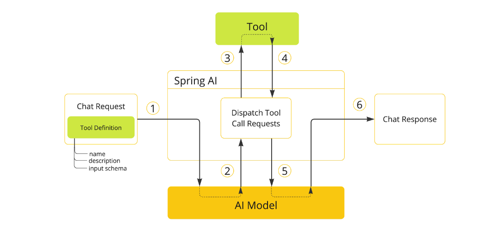

## 工具调用

工具调用（也称为_函数调用_）是 AI 应用程序中的一种常见模式，允许模型与一组 API 或_工具_交互，从而增强其能力。

工具主要用于：

- **信息检索**：此类工具可用于从外部源(如数据库、Web 服务、文件系统或 Web 搜索引擎)检索信息。目标是增强模型的知识，使其能够回答原本无法回答的问题。例如，工具可用于检索给定位置的当前天气、检索最新新闻文章或查询数据库中的特定记录。
- **执行操作**：此类工具可用于在软件系统中执行操作，如发送电子邮件、在数据库中创建新记录、提交表单或触发工作流。目标是自动化原本需要人工干预或显式编程的任务。例如，工具可用于为客户预订航班、填写网页表单或基于自动化测试(TDD)实现 Java 类。

尽管我们通常将_工具调用_称为模型能力，但实际上是由客户端应用程序提供工具调用逻辑。模型只能请求工具调用并提供输入参数，而应用程序负责从输入参数执行工具调用并返回结果。模型永远无法访问作为工具提供的任何 API，这是一个关键的安全考虑因素。

Spring AI 提供了便捷的 API 来定义工具、解析来自模型的工具调用请求并执行工具调用。

> **注意**: 查看[聊天模型比较](https://doc.spring4all.com/spring-ai/reference/chat-models.html#chat-models-comparison)以了解哪些 AI 模型支持工具调用。

> **提示**: 按照指南从已弃用的 FunctionCallback 迁移到 ToolCallback API。

### 快速开始

让我们看看如何在 Spring AI 中开始使用工具调用。我们将实现两个简单的工具:一个用于信息检索，一个用于执行操作。信息检索工具将用于获取用户时区的当前日期和时间。操作工具将用于在指定时间设置闹钟。

#### 信息检索

AI 模型无法访问实时信息。任何假设了解当前日期或天气预报等信息的问题都无法由模型回答。但是，我们可以提供一个可以检索这些信息的工具，让模型在需要访问实时信息时调用这个工具。

让我们在 `DateTimeTools` 类中实现一个工具来获取用户时区的当前日期和时间。该工具不需要参数。Spring Framework 的 `LocaleContextHolder` 可以提供用户的时区。该工具将定义为带有 `@Tool` 注解的方法。

```java
import java.time.LocalDateTime;
import org.springframework.ai.tool.annotation.Tool;
import org.springframework.context.i18n.LocaleContextHolder;

class DateTimeTools {
    @Tool(description = "Get the current date and time in the user's timezone")
    String getCurrentDateTime() {
        return LocalDateTime.now().atZone(LocaleContextHolder.getTimeZone().toZoneId()).toString();
    }
}
```

接下来，让我们使工具对模型可用。在此示例中，我们将使用 `ChatClient` 与模型交互。

```java
ChatModel chatModel = ...
String response = ChatClient.create(chatModel)
    .prompt("What day is tomorrow?")
    .tools(new DateTimeTools())
    .call()
    .content();
System.out.println(response);
```

输出将类似于：

```
Tomorrow is 2015-10-21.
```

你可以再次尝试问同样的问题。这次，不要向模型提供工具。输出将类似于：

```
I am an AI and do not have access to real-time information. Please provide the current date so I can accurately determine what day tomorrow will be.
```

没有工具，模型不知道如何回答这个问题，因为它无法确定当前日期和时间。

#### 执行操作

AI 模型可用于生成实现某些目标的计划。例如，模型可以生成预订丹麦之旅的计划。但是，模型没有执行计划的能力。这就是工具的用武之地：它们可用于执行模型生成的计划。

在前面的示例中，我们使用工具来确定当前日期和时间。在此示例中，我们将定义第二个工具，用于在特定时间设置闹钟。目标是设置从现在起 10 分钟的闹钟，因此我们需要向模型提供两个工具来完成此任务。

我们将新工具添加到与之前相同的 `DateTimeTools` 类中。新工具将接受一个参数，即 ISO-8601 格式的时间。然后，工具将在控制台打印一条消息，指示已为给定时间设置闹钟。与之前一样，该工具定义为带有 `@Tool` 注解的方法，我们还用它来提供详细描述，以帮助模型理解何时以及如何使用该工具。

```java
import java.time.LocalDateTime;
import java.time.format.DateTimeFormatter;
import org.springframework.ai.tool.annotation.Tool;
import org.springframework.context.i18n.LocaleContextHolder;

class DateTimeTools {
    @Tool(description = "Get the current date and time in the user's timezone")
    String getCurrentDateTime() {
        return LocalDateTime.now().atZone(LocaleContextHolder.getTimeZone().toZoneId()).toString();
    }

    @Tool(description = "Set a user alarm for the given time, provided in ISO-8601 format")
    void setAlarm(String time) {
        LocalDateTime alarmTime = LocalDateTime.parse(time, DateTimeFormatter.ISO_DATE_TIME);
        System.out.println("Alarm set for " + alarmTime);
    }
}
```

接下来，让我们使两个工具对模型可用。我们将使用 `ChatClient` 与模型交互。我们将通过 `tools()` 方法传递 `DateTimeTools` 的实例来向模型提供工具。当我们要求从现在起 10 分钟设置闹钟时，模型首先需要知道当前日期和时间。然后，它将使用当前日期和时间来计算闹钟时间。最后，它将使用闹钟工具来设置闹钟。在内部，`ChatClient` 将处理来自模型的任何工具调用请求，并将任何工具调用执行结果发送回模型，以便模型可以生成最终响应。

```java
ChatModel chatModel = ...
String response = ChatClient.create(chatModel)
    .prompt("Can you set an alarm 10 minutes from now?")
    .tools(new DateTimeTools())
    .call()
    .content();
System.out.println(response);
```

在应用程序日志中，你可以检查闹钟是否已在正确的时间设置。

### 概述

Spring AI 通过一组灵活的抽象来支持工具调用，这些抽象允许你以一致的方式定义、解析和执行工具。本节提供了 Spring AI 中工具调用的主要概念和组件的概述。



1. 当我们想要使工具对模型可用时，我们在聊天请求中包含其定义。每个工具定义包括名称、描述和输入参数的架构。

2. 当模型决定调用工具时，它会发送一个包含工具名称和按照定义架构建模的输入参数的响应。

3. 应用程序负责使用工具名称来识别和执行具有提供的输入参数的工具。

4. 工具调用的结果由应用程序处理。

5. 应用程序将工具调用结果发送回模型。

6. 模型使用工具调用结果作为额外上下文生成最终响应。

工具是工具调用的构建块，它们由 `ToolCallback` 接口建模。Spring AI 提供了内置支持，用于从方法和函数指定 `ToolCallback`(s)，但你始终可以定义自己的 `ToolCallback` 实现以支持更多用例。

`ChatModel` 实现透明地将工具调用请求分派给相应的 `ToolCallback` 实现，并将工具调用结果发送回模型，模型最终将生成最终响应。它们使用 `ToolCallingManager` 接口来执行此操作，该接口负责管理工具执行生命周期。

`ChatClient` 和 `ChatModel` 都接受 `ToolCallback` 对象列表，以使工具对模型可用，以及最终执行它们的 `ToolCallingManager`。

除了直接传递 `ToolCallback` 对象外，你还可以传递工具名称列表，这些名称将使用 `ToolCallbackResolver` 接口动态解析。

以下部分将详细介绍所有这些概念和 API，包括如何自定义和扩展它们以支持更多用例。

### 方法作为工具

Spring AI 提供了内置支持，用于以两种方式从方法指定工具（即 `ToolCallback`(s)）：

- 声明式，使用 `@Tool` 注解
- 编程式，使用低级 `MethodToolCallback` 实现。

#### 声明式规范: @Tool

你可以通过用 `@Tool` 注解方法来将方法转换为工具。

```java
class DateTimeTools {
    @Tool(description = "Get the current date and time in the user's timezone")
    String getCurrentDateTime() {
        return LocalDateTime.now().atZone(LocaleContextHolder.getTimeZone().toZoneId()).toString();
    }
}
```

`@Tool` 注解允许你提供有关工具的关键信息：

- `name`：工具的名称。如果未提供，将使用方法名称。
- `description`：工具的描述，模型可以使用它来理解何时以及如何调用工具。
- `returnDirect`：工具结果是否应该直接返回给客户端或传回给模型。
- `resultConverter`：用于将工具调用结果转换为要发送回 AI 模型的 `String` 对象的 `ToolCallResultConverter` 实现。

方法可以是静态的或实例的，它可以具有任何可见性（public、protected、package-private 或 private）。包含该方法的类可以是顶级类或嵌套类，它也可以具有任何可见性（只要它在计划实例化它的地方可访问）。

注意：只要包含方法的类是 Spring bean（例如 `@Component`），Spring AI 就提供对 `@Tool` 注解方法的 AOT 编译的内置支持。否则，你需要向 GraalVM 编译器提供必要的配置。例如，通过用 `@RegisterReflection(memberCategories = MemberCategory.INVOKE_DECLARED_METHODS)` 注解类。

你可以为方法定义任意数量的参数（包括无参数），支持大多数类型（基本类型、POJO、枚举、列表、数组、映射等）。同样，该方法可以返回大多数类型，包括 `void`。如果该方法返回值，则返回类型必须是可序列化类型，因为结果将被序列化并发送回模型。

注意：某些类型不受支持。

Spring AI 将自动为 `@Tool` 注解方法的输入参数生成 JSON 架构。可以使用 `@ToolParam` 注解来提供有关输入参数的额外信息。

```java
import java.time.LocalDateTime;
import java.time.format.DateTimeFormatter;
import org.springframework.ai.tool.annotation.Tool;
import org.springframework.ai.tool.annotation.ToolParam;

class DateTimeTools {
    @Tool(description = "Set a user alarm for the given time")
    void setAlarm(@ToolParam(description = "Time in ISO-8601 format") String time) {
        LocalDateTime alarmTime = LocalDateTime.parse(time, DateTimeFormatter.ISO_DATE_TIME);
        System.out.println("Alarm set for " + alarmTime);
    }
}
```

`@ToolParam` 注解允许你提供有关工具参数的关键信息：

- `description`：参数的描述
- `required`：参数是必需还是可选的。默认情况下，所有参数都被视为必需的。

如果参数被注解为 `@Nullable`，除非使用 `@ToolParam` 注解明确标记为必需，否则它将被视为可选的。

除了 `@ToolParam` 注解外，你还可以使用 Swagger 的 `@Schema` 注解或 Jackson 的 `@JsonProperty`。有关详细信息，请参见 JSON Schema。

##### 向 ChatClient 添加工具

使用声明式规范方法时，你可以在调用 `ChatClient` 时通过 `tools()` 方法传递工具类实例。此类工具仅对添加它们的特定聊天请求可用。

```java
ChatClient.create(chatModel)
    .prompt("What day is tomorrow?")
    .tools(new DateTimeTools())
    .call()
    .content();
```

在底层，`ChatClient` 将从工具类实例中的每个 `@Tool` 注解方法生成 `ToolCallback`，并将它们传递给模型。如果你希望自己生成 `ToolCallback`(s)，可以使用 `ToolCallbacks` 工具类。

```java
ToolCallback[] dateTimeTools = ToolCallbacks.from(new DateTimeTools());
```

##### 向 ChatClient 添加默认工具

使用声明式规范方法时，你可以通过将工具类实例传递给 `defaultTools()` 方法来向 `ChatClient.Builder` 添加默认工具。 如果同时提供了默认工具和运行时工具，运行时工具将完全覆盖默认工具。

警告：默认工具在所有由同一 `ChatClient.Builder` 构建的所有 `ChatClient` 实例执行的所有聊天请求之间共享。它们对于在不同聊天请求之间常用的工具很有用，但如果使用不当，也可能很危险，可能会在不应该时使它们可用。

```java
ChatModel chatModel = ...
ChatClient chatClient = ChatClient.builder(chatModel)
    .defaultTools(new DateTimeTools())
    .build();
```

#### 编程式规范: MethodToolCallback

使用声明式规范方法时，你可以通过将工具类实例传递给用于调用 `ChatModel` 的 `ToolCallingChatOptions` 的 `toolCallbacks()` 方法来向 `ChatModel` 添加工具。此类工具仅对添加它们的特定聊天请求可用。

```java
class DateTimeTools {
    String getCurrentDateTime() {
        return LocalDateTime.now().atZone(LocaleContextHolder.getTimeZone().toZoneId()).toString();
    }
}
```

#### 向 ChatModel 添加默认工具

使用声明式规范方法时，你可以通过将工具类实例传递给用于创建 `ChatModel` 的 `ToolCallingChatOptions` 实例的 `toolCallbacks()` 方法来向 `ChatModel` 添加默认工具。 如果同时提供了默认工具和运行时工具，运行时工具将完全覆盖默认工具。

警告：默认工具在该 `ChatModel` 实例执行的所有聊天请求之间共享。它们对于在不同聊天请求之间常用的工具很有用，但如果使用不当，也可能很危险，可能会在不应该时使它们可用。

```java
Method method = ReflectionUtils.findMethod(DateTimeTools.class, "getCurrentDateTime");
ToolCallback toolCallback = MethodToolCallback.builder()
    .toolDefinition(ToolDefinition.builder(method)
        .description("Get the current date and time in the user's timezone")
        .build())
    .toolMethod(method)
    .toolObject(new DateTimeTools())
    .build();
```


### 函数作为工具

Spring AI 提供了内置支持，用于以两种方式从方法指定工具（即 `ToolCallback`(s)）：

- 声明式，使用 `@Tool` 注解

- 编程式，使用低级 `MethodToolCallback` 实现。

#### 编程式规范: MethodToolCallback

// 写到这里 困了 先睡觉了

你可以通过构建低级 `MethodToolCallback` 程序化来将功能类型转换为工具。

```java
public class WeatherService implements Function<WeatherRequest, WeatherResponse> {
    public WeatherResponse apply(WeatherRequest request) {
        return new WeatherResponse(30.0, Unit.C);
    }
}

public enum Unit { C, F }
public record WeatherRequest(String location, Unit unit) {}
public record WeatherResponse(double temp, Unit unit) {}
```

```java
ToolCallback toolCallback = FunctionToolCallback
    .builder("currentWeather", new WeatherService())
    .description("Get the weather in location")
    .inputType(WeatherRequest.class)
    .build();
```

#### 动态规范: @Tool

你可以将工具定义为 Spring beans，并让 Spring AI 在运行时使用 `ToolCallbackResolver` 接口解析它们。

```java
@Configuration(proxyBeanMethods = false)
class WeatherTools {
    WeatherService weatherService = new WeatherService();

    @Bean
    @Description("Get the weather in location")
    Function<WeatherRequest, WeatherResponse> currentWeather() {
        return weatherService;
    }
}
```

#### 方法工具限制

以下类型目前不支持作为方法参数或返回类型：

- `Optional`
- 异步类型(例如 `CompletableFuture`、`Future`)
- 反应类型(例如 `Flow`、`Mono`、`Flux`)
- 功能类型(例如 `Function`、`Supplier`、`Consumer`)

##### 向 ChatClient 添加工具

```java
ChatClient.create(chatModel)
    .prompt("What's the weather like in Copenhagen?")
    .tools("currentWeather")
    .call()
    .content();
```

#### 函数工具限制

以下类型目前不支持作为函数输入或输出类型：

- 基本类型
- `Optional`
- 集合类型(例如 `List`、`Map`、`Array`、`Set`)
- 异步类型(例如 `CompletableFuture`、`Future`)
- 反应类型(例如 `Flow`、`Mono`、`Flux`)

### 工具规范

#### Tool Callback

`ToolCallback` 接口提供了一种方法来定义可以由 AI 模型调用的工具，包括定义和执行逻辑。

```java
public interface ToolCallback {
    /**
     * 用于确定 AI 模型何时以及如何调用工具的定义。
     */
    ToolDefinition getToolDefinition();

    /**
     * 提供有关如何处理工具的附加信息。
     */
    ToolMetadata getToolMetadata();

    /**
     * 执行工具并返回结果以发送回 AI 模型。
     */
    String call(String toolInput);

    /**
     * 执行工具并返回结果以发送回 AI 模型。
     */
    String call(String toolInput, ToolContext tooContext);
}
```

#### Tool Definition

`ToolDefinition` 接口提供了 AI 模型了解工具可用性的必要信息，包括工具名称、描述和输入架构。

```java
public interface ToolDefinition {
    /**
     * 工具名称。在提供给模型的工具集中是唯一的。
     */
    String name();

    /**
     * 用于确定 AI 模型工具的作用的工具描述。
     */
    String description();

    /**
     * 调用工具时使用的参数架构。
     */
    String inputSchema();
}
```

#### JSON Schema

提供工具给 AI 模型时，模型需要知道工具的输入类型架构。Spring AI 提供了内置支持，用于通过 `JsonSchemaGenerator` 类生成工具的输入类型架构。

##### Description

你可以为工具的输入参数提供描述，使用以下注解之一：

- Spring AI 的 `@ToolParam(description = "…​")`
- Jackson 的 `@JsonClassDescription(description = "…​")`
- Jackson 的 `@JsonPropertyDescription(description = "…​")`
- Swagger 的 `@Schema(description = "…​")`

##### Required/Optional

默认情况下，每个输入参数都被视为必需的。你可以使用以下注解之一来使输入参数可选：

- Spring AI 的 `@ToolParam(required = false)`
- Jackson 的 `@JsonProperty(required = false)`
- Swagger 的 `@Schema(required = false)`
- Spring Framework 的 `@Nullable`

#### Result Conversion

工具调用的结果使用 `ToolCallResultConverter` 序列化并发送回 AI 模型。

```java
@FunctionalInterface
public interface ToolCallResultConverter {
    /**
     * 给定一个由工具返回的对象，将其转换为与给定类类型兼容的字符串。
     */
    String convert(@Nullable Object result, @Nullable Type returnType);
}
```

#### Tool Context

Spring AI 支持通过 `ToolContext` API 将附加上下文信息传递给工具。

```java
class CustomerTools {
    @Tool(description = "Retrieve customer information")
    Customer getCustomerInfo(Long id, ToolContext toolContext) {
        return customerRepository.findById(id, toolContext.get("tenantId"));
    }
}
```

```java
ChatModel chatModel = ...
String response = ChatClient.create(chatModel)
    .prompt("Tell me more about the customer with ID 42")
    .tools(new CustomerTools())
    .toolContext(Map.of("tenantId", "acme"))
    .call()
    .content();
System.out.println(response);
```

#### Return Direct

默认情况下，工具调用结果作为响应发送回模型。有些情况下，你宁愿直接将结果返回给调用者，而不是发送回模型。

```java
class CustomerTools {
    @Tool(description = "Retrieve customer information", returnDirect = true)
    Customer getCustomerInfo(Long id) {
        return customerRepository.findById(id);
    }
}
```

### 工具执行

工具执行是调用工具并返回结果的过程。工具执行由 `ToolCallingManager` 接口处理，该接口负责管理工具执行生命周期。

#### Framework-Controlled Tool Execution

当使用默认行为时，Spring AI 将自动拦截任何工具调用请求从模型，调用工具并返回结果到模型。

#### User-Controlled Tool Execution

有些情况下，你宁愿控制工具执行生命周期。你可以通过将 `internalToolExecutionEnabled` 属性设置为 `false` 来实现。

```java
ChatModel chatModel = ...
ToolCallingManager toolCallingManager = ToolCallingManager.builder().build();
ChatOptions chatOptions = ToolCallingChatOptions.builder()
    .toolCallbacks(new CustomerTools())
    .internalToolExecutionEnabled(false)
    .build();
Prompt prompt = new Prompt("Tell me more about the customer with ID 42", chatOptions);
ChatResponse chatResponse = chatModel.call(prompt);
while (chatResponse.hasToolCalls()) {
    ToolExecutionResult toolExecutionResult = toolCallingManager.executeToolCalls(prompt, chatResponse);
    prompt = new Prompt(toolExecutionResult.conversationHistory(), chatOptions);
    chatResponse = chatModel.call(prompt);
}
System.out.println(chatResponse.getResult().getOutput().getText());
```

#### Exception Handling

当工具调用失败时，异常作为 `ToolExecutionException` 传播，可以捕获以处理错误。

```java
@FunctionalInterface
public interface ToolExecutionExceptionProcessor {
    /**
     * 将工具抛出的异常转换为可以发送回 AI 模型的字符串，或者抛出异常以由调用者处理。
     */
    String process(ToolExecutionException exception);
}
```

### 工具解析

Spring AI 支持在运行时使用 `ToolCallbackResolver` 接口动态解析工具。

```java
public interface ToolCallbackResolver {
    /**
     * 解析给定工具名称的 {@link ToolCallback}。
     */
    @Nullable
    ToolCallback resolve(String toolName);
}
```

### Observability

工具调用包括 spring.ai.tool 观察支持，spring.ai.tool 观察测量完成时间和传播跟踪信息。

### Logging

所有主要工具调用功能操作都在 DEBUG 级别记录。你可以通过将日志级别设置为 DEBUG 来启用日志记录 `org.springframework.ai` 包。
