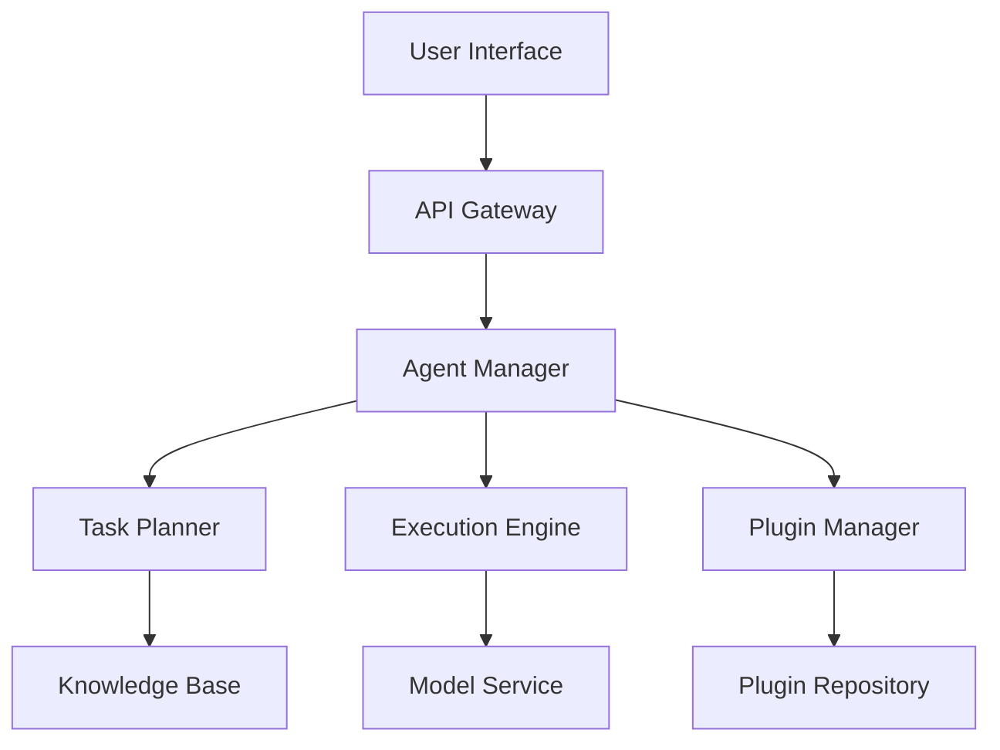

# JManus

JManus is a universal agent platform built on Spring AI Alibaba, providing complete agent lifecycle management and autonomous planning capabilities.

## Platform Overview

### Core Features
- **Autonomous Planning**: Agents have autonomous task decomposition and execution planning capabilities
- **Multimodal Support**: Support for text, image, audio, and other input/output types
- **Plugin Ecosystem**: Rich plugin system supporting custom extensions
- **Visual Management**: Intuitive web interface for agent management
- **Enterprise Deployment**: Support for distributed deployment and high availability architecture

### Architecture Design



## Quick Start

### Environment Setup

```bash
# Clone project
git clone https://github.com/springaialibaba/jmanus.git
cd jmanus

# Configure environment variables
cp .env.example .env
# Edit .env file to configure necessary API keys
```

### Docker Deployment

```yaml
# docker-compose.yml
version: '3.8'
services:
  jmanus-backend:
    image: springai/jmanus-backend:latest
    ports:
      - "8080:8080"
    environment:
      - SPRING_PROFILES_ACTIVE=docker
      - DASHSCOPE_API_KEY=${DASHSCOPE_API_KEY}
    depends_on:
      - postgres
      - redis
  
  jmanus-frontend:
    image: springai/jmanus-frontend:latest
    ports:
      - "3000:3000"
    environment:
      - REACT_APP_API_URL=http://localhost:8080
  
  postgres:
    image: postgres:15
    environment:
      - POSTGRES_DB=jmanus
      - POSTGRES_USER=jmanus
      - POSTGRES_PASSWORD=password
    volumes:
      - postgres_data:/var/lib/postgresql/data
  
  redis:
    image: redis:7-alpine
    ports:
      - "6379:6379"

volumes:
  postgres_data:
```

### Start Services

```bash
# Start all services
docker-compose up -d

# Check service status
docker-compose ps

# Access frontend interface
open http://localhost:3000
```

## Agent Creation

### Create via Web Interface

1. **Login System**: Visit `http://localhost:3000` and login
2. **Create Agent**: Click "New Agent" button
3. **Configure Basic Info**: Set name, description, type, etc.
4. **Select Capabilities**: Configure agent's core capabilities and plugins
5. **Test and Deploy**: Perform functional testing and deploy

### Create via API

```java
@RestController
@RequestMapping("/api/agents")
public class AgentController {
    
    @Autowired
    private AgentService agentService;
    
    @PostMapping
    public ResponseEntity<Agent> createAgent(@RequestBody CreateAgentRequest request) {
        Agent agent = agentService.createAgent(
            AgentDefinition.builder()
                .name(request.getName())
                .description(request.getDescription())
                .type(request.getType())
                .capabilities(request.getCapabilities())
                .plugins(request.getPlugins())
                .build()
        );
        
        return ResponseEntity.ok(agent);
    }
}
```

### Create via Configuration File

```yaml
# agent-config.yml
agent:
  name: "Customer Service Assistant"
  description: "Intelligent customer service agent for handling user inquiries and problem resolution"
  type: "customer-service"
  
  capabilities:
    - name: "Q&A"
      type: "qa"
      config:
        knowledge_base: "customer-kb"
        confidence_threshold: 0.8
    
    - name: "Sentiment Analysis"
      type: "sentiment"
      config:
        model: "sentiment-analysis-v1"
    
    - name: "Ticket Creation"
      type: "ticket"
      config:
        system: "jira"
        project: "SUPPORT"
  
  plugins:
    - name: "knowledge-search"
      version: "1.0.0"
    - name: "ticket-manager"
      version: "2.1.0"
  
  settings:
    max_conversation_length: 50
    response_timeout: 30s
    auto_escalation: true
```

## Autonomous Planning

### Task Decomposition

```java
@Component
public class TaskPlanner {
    
    @Autowired
    private ChatClient chatClient;
    
    public TaskPlan planTask(String objective) {
        String planningPrompt = String.format("""
            As a task planning expert, please decompose the following objective into specific execution steps:
            
            Objective: %s
            
            Please output in the following format:
            1. Step Name - Step Description - Required Capabilities - Estimated Time
            2. ...
            
            Ensure steps have logical order and each step is executable.
            """, objective);
        
        String planText = chatClient.prompt()
            .user(planningPrompt)
            .call()
            .content();
        
        return parsePlan(planText);
    }
    
    private TaskPlan parsePlan(String planText) {
        List<TaskStep> steps = Arrays.stream(planText.split("\n"))
            .filter(line -> line.matches("\\d+\\..*"))
            .map(this::parseStep)
            .collect(Collectors.toList());
        
        return TaskPlan.builder()
            .steps(steps)
            .createdAt(Instant.now())
            .build();
    }
}
```

### Dynamic Adjustment

```java
@Component
public class AdaptivePlanner {
    
    public TaskPlan adjustPlan(TaskPlan originalPlan, ExecutionContext context) {
        // Analyze current execution status
        ExecutionAnalysis analysis = analyzeExecution(context);
        
        if (analysis.needsAdjustment()) {
            String adjustmentPrompt = String.format("""
                Original plan execution encountered issues and needs adjustment:
                
                Original Plan: %s
                Current Status: %s
                Issues Encountered: %s
                
                Please provide an adjusted plan.
                """, 
                originalPlan.toString(),
                context.getCurrentStatus(),
                analysis.getIssues()
            );
            
            String adjustedPlanText = chatClient.prompt()
                .user(adjustmentPrompt)
                .call()
                .content();
            
            return parsePlan(adjustedPlanText);
        }
        
        return originalPlan;
    }
}
```

## Plugin System

### Plugin Interface

```java
public interface JManusPlugin {
    
    String getName();
    String getVersion();
    String getDescription();
    
    void initialize(PluginContext context);
    void shutdown();
    
    List<Capability> getCapabilities();
    PluginResult execute(PluginRequest request);
}
```

### Example Plugin

```java
@Plugin(name = "web-search", version = "1.0.0")
public class WebSearchPlugin implements JManusPlugin {
    
    @Autowired
    private WebSearchService searchService;
    
    @Override
    public String getName() {
        return "web-search";
    }
    
    @Override
    public List<Capability> getCapabilities() {
        return List.of(
            Capability.builder()
                .name("search")
                .description("Search web information")
                .parameters(Map.of(
                    "query", "Search keywords",
                    "limit", "Result count limit"
                ))
                .build()
        );
    }
    
    @Override
    public PluginResult execute(PluginRequest request) {
        String query = request.getParameter("query");
        int limit = request.getParameter("limit", 10);
        
        List<SearchResult> results = searchService.search(query, limit);
        
        return PluginResult.success(results);
    }
}
```

### Plugin Management

```java
@Service
public class PluginManager {
    
    private final Map<String, JManusPlugin> plugins = new ConcurrentHashMap<>();
    
    public void loadPlugin(String pluginPath) {
        try {
            JManusPlugin plugin = loadPluginFromPath(pluginPath);
            plugin.initialize(createPluginContext());
            plugins.put(plugin.getName(), plugin);
            
            log.info("Plugin loaded: {} v{}", plugin.getName(), plugin.getVersion());
        } catch (Exception e) {
            log.error("Failed to load plugin: {}", pluginPath, e);
        }
    }
    
    public PluginResult executePlugin(String pluginName, PluginRequest request) {
        JManusPlugin plugin = plugins.get(pluginName);
        if (plugin == null) {
            return PluginResult.error("Plugin not found: " + pluginName);
        }
        
        try {
            return plugin.execute(request);
        } catch (Exception e) {
            log.error("Plugin execution failed: {}", pluginName, e);
            return PluginResult.error("Execution failed: " + e.getMessage());
        }
    }
}
```

## Knowledge Base Integration

### Knowledge Base Configuration

```java
@Configuration
public class KnowledgeBaseConfig {
    
    @Bean
    public VectorStore vectorStore() {
        return new PineconeVectorStore(
            PineconeVectorStoreConfig.builder()
                .apiKey("${pinecone.api-key}")
                .environment("${pinecone.environment}")
                .indexName("jmanus-knowledge")
                .build()
        );
    }
    
    @Bean
    public DocumentProcessor documentProcessor() {
        return DocumentProcessor.builder()
            .textSplitter(new TokenTextSplitter(500, 50))
            .embeddingModel(embeddingModel())
            .build();
    }
}
```

### Knowledge Retrieval

```java
@Service
public class KnowledgeService {
    
    @Autowired
    private VectorStore vectorStore;
    
    public List<Document> searchKnowledge(String query, int limit) {
        return vectorStore.similaritySearch(
            SearchRequest.query(query)
                .withTopK(limit)
                .withSimilarityThreshold(0.7)
        );
    }
    
    public void addKnowledge(String content, Map<String, Object> metadata) {
        Document document = new Document(content, metadata);
        vectorStore.add(List.of(document));
    }
    
    public void updateKnowledge(String documentId, String newContent) {
        vectorStore.delete(List.of(documentId));
        addKnowledge(newContent, Map.of("updated", Instant.now()));
    }
}
```

## Conversation Management

### Conversation State

```java
@Entity
@Table(name = "conversations")
public class Conversation {
    @Id
    private String id;
    
    @Column(name = "agent_id")
    private String agentId;
    
    @Column(name = "user_id")
    private String userId;
    
    @Enumerated(EnumType.STRING)
    private ConversationStatus status;
    
    @Column(name = "context", columnDefinition = "jsonb")
    private Map<String, Object> context;
    
    @Column(name = "created_at")
    private Instant createdAt;
    
    @Column(name = "updated_at")
    private Instant updatedAt;
    
    // getters and setters
}
```

### Conversation Processing

```java
@Service
public class ConversationService {
    
    @Autowired
    private ConversationRepository conversationRepository;
    
    @Autowired
    private AgentService agentService;
    
    public ConversationResponse processMessage(String conversationId, String message) {
        Conversation conversation = conversationRepository.findById(conversationId)
            .orElseThrow(() -> new ConversationNotFoundException(conversationId));
        
        Agent agent = agentService.getAgent(conversation.getAgentId());
        
        // Update conversation context
        conversation.getContext().put("lastMessage", message);
        conversation.getContext().put("lastMessageTime", Instant.now());
        
        // Process message
        String response = agent.processMessage(message, conversation.getContext());
        
        // Save conversation record
        saveMessage(conversationId, message, response);
        
        // Update conversation status
        conversation.setUpdatedAt(Instant.now());
        conversationRepository.save(conversation);
        
        return ConversationResponse.builder()
            .conversationId(conversationId)
            .response(response)
            .timestamp(Instant.now())
            .build();
    }
}
```

## Configuration Options

```properties
# JManus core configuration
jmanus.agent.max-concurrent-tasks=10
jmanus.agent.task-timeout=300s
jmanus.agent.auto-scaling=true

# Plugin configuration
jmanus.plugins.directory=/plugins
jmanus.plugins.auto-load=true
jmanus.plugins.security.enabled=true

# Knowledge base configuration
jmanus.knowledge.vector-store=pinecone
jmanus.knowledge.embedding-model=text-embedding-ada-002
jmanus.knowledge.chunk-size=500

# Monitoring configuration
jmanus.monitoring.enabled=true
jmanus.monitoring.metrics.export.prometheus=true
jmanus.monitoring.alerts.email=admin@example.com
```

## Best Practices

### 1. Agent Design
- Define clear agent responsibility boundaries
- Design reasonable capability combinations
- Implement graceful error handling

### 2. Plugin Development
- Follow single responsibility principle
- Provide detailed documentation
- Implement comprehensive test cases

### 3. Performance Optimization
- Configure concurrency parameters reasonably
- Implement caching strategies
- Monitor resource usage

### 4. Security Considerations
- Implement access controls
- Validate input data
- Protect sensitive information

## Next Steps

- [Explore DeepResearch](/docs/1.0.0.3/playground/deepresearch/)
- [Learn NL2SQL](/docs/1.0.0.3/playground/nl2sql/)
- [Understand Multi-Agent Architectures](/docs/1.0.0.3/multi-agent/architectures/)
