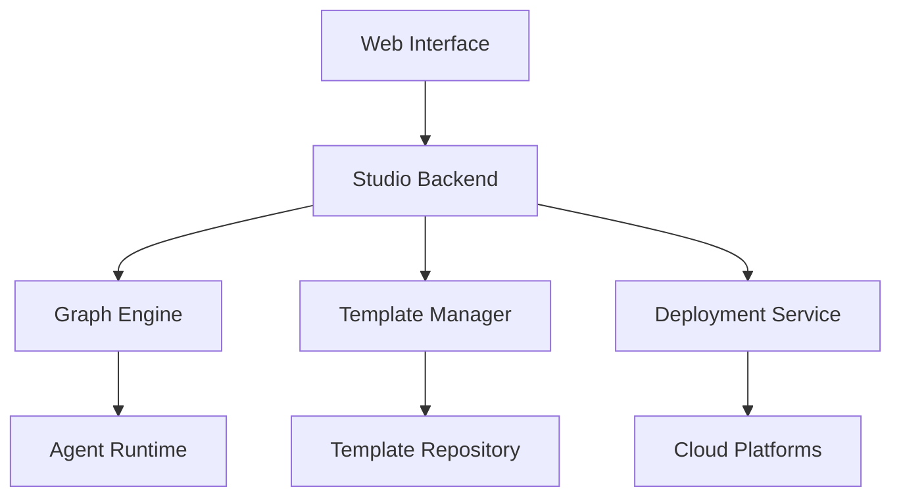

# Studio

Spring AI Alibaba Studio is a comprehensive development environment that provides visual tools for building, testing, and deploying AI applications.

## Overview

### Core Features
- **Visual Graph Editor**: Drag-and-drop interface for building multi-agent workflows
- **Real-time Testing**: Live testing and debugging capabilities
- **Template Library**: Pre-built templates for common use cases
- **Deployment Tools**: One-click deployment to various environments
- **Monitoring Dashboard**: Real-time monitoring and analytics

### Architecture



## Getting Started

### Installation

```bash
# Install Studio CLI
npm install -g @spring-ai/studio-cli

# Create new project
studio create my-ai-app
cd my-ai-app

# Start development server
studio dev
```

### Docker Setup

```yaml
# docker-compose.yml
version: '3.8'
services:
  studio-frontend:
    image: springai/studio-frontend:latest
    ports:
      - "3000:3000"
    environment:
      - REACT_APP_API_URL=http://localhost:8080
  
  studio-backend:
    image: springai/studio-backend:latest
    ports:
      - "8080:8080"
    environment:
      - SPRING_PROFILES_ACTIVE=docker
      - DASHSCOPE_API_KEY=${DASHSCOPE_API_KEY}
    depends_on:
      - postgres
      - redis
  
  postgres:
    image: postgres:15
    environment:
      - POSTGRES_DB=studio
      - POSTGRES_USER=studio
      - POSTGRES_PASSWORD=password
  
  redis:
    image: redis:7-alpine
```

## Visual Graph Editor

### Creating Workflows

The visual graph editor allows you to create complex multi-agent workflows through a drag-and-drop interface:

1. **Add Nodes**: Drag agent nodes from the palette
2. **Connect Nodes**: Draw connections between nodes
3. **Configure Properties**: Set node properties and parameters
4. **Test Flow**: Run test executions
5. **Deploy**: Deploy to production

### Node Types

#### Agent Nodes
```javascript
// Agent node configuration
{
  "type": "agent",
  "id": "analyzer",
  "name": "Data Analyzer",
  "config": {
    "model": "qwen-max",
    "temperature": 0.7,
    "systemPrompt": "You are a data analysis expert..."
  }
}
```

#### Decision Nodes
```javascript
// Decision node configuration
{
  "type": "decision",
  "id": "classifier",
  "name": "Content Classifier",
  "config": {
    "conditions": [
      {
        "condition": "contentType === 'text'",
        "target": "text_processor"
      },
      {
        "condition": "contentType === 'image'",
        "target": "image_processor"
      }
    ]
  }
}
```

#### Tool Nodes
```javascript
// Tool node configuration
{
  "type": "tool",
  "id": "web_search",
  "name": "Web Search",
  "config": {
    "toolName": "webSearch",
    "parameters": {
      "query": "${input.query}",
      "limit": 10
    }
  }
}
```

## Template System

### Built-in Templates

Studio provides various pre-built templates:

#### Customer Service Template
```yaml
name: "Customer Service Bot"
description: "Intelligent customer service with ticket creation"
nodes:
  - id: "intent_classifier"
    type: "agent"
    config:
      systemPrompt: "Classify customer intent..."
  
  - id: "qa_agent"
    type: "agent"
    config:
      systemPrompt: "Answer customer questions..."
  
  - id: "ticket_creator"
    type: "tool"
    config:
      toolName: "createTicket"

connections:
  - from: "intent_classifier"
    to: "qa_agent"
    condition: "intent === 'question'"
  
  - from: "intent_classifier"
    to: "ticket_creator"
    condition: "intent === 'complaint'"
```

#### Research Assistant Template
```yaml
name: "Research Assistant"
description: "Multi-source research and report generation"
nodes:
  - id: "query_analyzer"
    type: "agent"
    config:
      systemPrompt: "Analyze research queries..."
  
  - id: "web_searcher"
    type: "tool"
    config:
      toolName: "webSearch"
  
  - id: "content_analyzer"
    type: "agent"
    config:
      systemPrompt: "Analyze collected content..."
  
  - id: "report_generator"
    type: "agent"
    config:
      systemPrompt: "Generate research reports..."
```

### Custom Templates

```javascript
// Create custom template
const template = {
  name: "Custom Workflow",
  description: "My custom AI workflow",
  category: "custom",
  nodes: [
    {
      id: "input_processor",
      type: "agent",
      position: { x: 100, y: 100 },
      config: {
        model: "qwen-max",
        systemPrompt: "Process user input..."
      }
    }
  ],
  connections: [],
  metadata: {
    author: "John Doe",
    version: "1.0.0",
    tags: ["custom", "workflow"]
  }
};

// Save template
await studioAPI.saveTemplate(template);
```

## Testing and Debugging

### Live Testing

```javascript
// Test workflow execution
const testResult = await studioAPI.testWorkflow({
  workflowId: "my-workflow",
  input: {
    message: "Hello, I need help with my order",
    userId: "user123"
  },
  options: {
    debug: true,
    stepByStep: true
  }
});

console.log("Test Result:", testResult);
```

### Debug Mode

Studio provides comprehensive debugging capabilities:

1. **Step-by-step Execution**: Execute nodes one by one
2. **State Inspection**: View state at each step
3. **Log Streaming**: Real-time log output
4. **Performance Metrics**: Execution time and resource usage

### Test Cases

```javascript
// Define test cases
const testCases = [
  {
    name: "Customer Question",
    input: {
      message: "What are your business hours?",
      userId: "test-user-1"
    },
    expectedOutput: {
      intent: "question",
      response: "Our business hours are..."
    }
  },
  {
    name: "Complaint Handling",
    input: {
      message: "I'm not satisfied with my order",
      userId: "test-user-2"
    },
    expectedOutput: {
      intent: "complaint",
      ticketCreated: true
    }
  }
];

// Run test suite
const results = await studioAPI.runTestSuite(workflowId, testCases);
```

## Deployment

### Local Deployment

```bash
# Build for production
studio build

# Deploy locally
studio deploy --target local --port 8080
```

### Cloud Deployment

```javascript
// Deploy to cloud
const deployment = await studioAPI.deploy({
  workflowId: "my-workflow",
  target: "cloud",
  config: {
    platform: "alibaba-cloud",
    region: "cn-hangzhou",
    scaling: {
      minInstances: 1,
      maxInstances: 10,
      targetCPU: 70
    }
  }
});

console.log("Deployment URL:", deployment.url);
```

### Kubernetes Deployment

```yaml
# k8s-deployment.yml
apiVersion: apps/v1
kind: Deployment
metadata:
  name: ai-workflow
spec:
  replicas: 3
  selector:
    matchLabels:
      app: ai-workflow
  template:
    metadata:
      labels:
        app: ai-workflow
    spec:
      containers:
      - name: workflow
        image: my-registry/ai-workflow:latest
        ports:
        - containerPort: 8080
        env:
        - name: DASHSCOPE_API_KEY
          valueFrom:
            secretKeyRef:
              name: ai-secrets
              key: dashscope-key
```

## Monitoring and Analytics

### Real-time Dashboard

Studio provides a comprehensive monitoring dashboard:

1. **Execution Metrics**: Request count, response time, error rate
2. **Resource Usage**: CPU, memory, network usage
3. **Agent Performance**: Individual agent metrics
4. **User Analytics**: User behavior and satisfaction

### Custom Metrics

```javascript
// Define custom metrics
const metrics = {
  customerSatisfaction: {
    type: "gauge",
    description: "Customer satisfaction score",
    labels: ["agent_id", "conversation_type"]
  },
  
  resolutionTime: {
    type: "histogram",
    description: "Time to resolve customer issues",
    buckets: [1, 5, 10, 30, 60, 300]
  }
};

// Record metrics
studioAPI.recordMetric("customerSatisfaction", 4.5, {
  agent_id: "support-agent-1",
  conversation_type: "technical"
});
```

### Alerting

```javascript
// Configure alerts
const alertRules = [
  {
    name: "High Error Rate",
    condition: "error_rate > 0.05",
    duration: "5m",
    actions: [
      {
        type: "email",
        recipients: ["admin@example.com"]
      },
      {
        type: "webhook",
        url: "https://hooks.slack.com/..."
      }
    ]
  }
];

await studioAPI.configureAlerts(alertRules);
```

## Integration

### API Integration

```javascript
// Studio REST API
const studioClient = new StudioClient({
  baseURL: "https://studio.example.com/api",
  apiKey: "your-api-key"
});

// Execute workflow
const result = await studioClient.executeWorkflow({
  workflowId: "customer-service",
  input: {
    message: "I need help",
    userId: "user123"
  }
});
```

### Webhook Integration

```javascript
// Configure webhooks
const webhook = {
  url: "https://your-app.com/webhook",
  events: ["workflow.completed", "workflow.failed"],
  secret: "webhook-secret"
};

await studioAPI.createWebhook(webhook);
```

### SDK Integration

```java
// Java SDK
@Autowired
private StudioClient studioClient;

public String processUserMessage(String message, String userId) {
    WorkflowRequest request = WorkflowRequest.builder()
        .workflowId("customer-service")
        .input(Map.of(
            "message", message,
            "userId", userId
        ))
        .build();
    
    WorkflowResult result = studioClient.executeWorkflow(request);
    return result.getOutput().get("response").toString();
}
```

## Configuration Options

```properties
# Studio configuration
studio.enabled=true
studio.workspace.path=/workspace
studio.templates.auto-sync=true

# Editor configuration
studio.editor.auto-save=true
studio.editor.auto-save-interval=30s
studio.editor.max-nodes=100

# Deployment configuration
studio.deployment.default-target=local
studio.deployment.timeout=300s
studio.deployment.retry-attempts=3

# Monitoring configuration
studio.monitoring.enabled=true
studio.monitoring.metrics.retention=30d
studio.monitoring.alerts.enabled=true
```

## Best Practices

### 1. Workflow Design
- Keep workflows simple and focused
- Use meaningful node names
- Document complex logic
- Test thoroughly before deployment

### 2. Performance Optimization
- Minimize node count
- Use parallel execution where possible
- Implement caching strategies
- Monitor resource usage

### 3. Error Handling
- Add error handling nodes
- Implement retry mechanisms
- Provide fallback options
- Log errors appropriately

### 4. Security
- Secure API keys and secrets
- Implement access controls
- Validate input data
- Monitor for suspicious activity

## Next Steps

- [Learn about JManus](/docs/1.0.0.3/playground/jmanus/)
- [Explore DeepResearch](/docs/1.0.0.3/playground/deepresearch/)
- [Understand Multi-Agent Systems](/docs/1.0.0.3/multi-agent/agents/)
