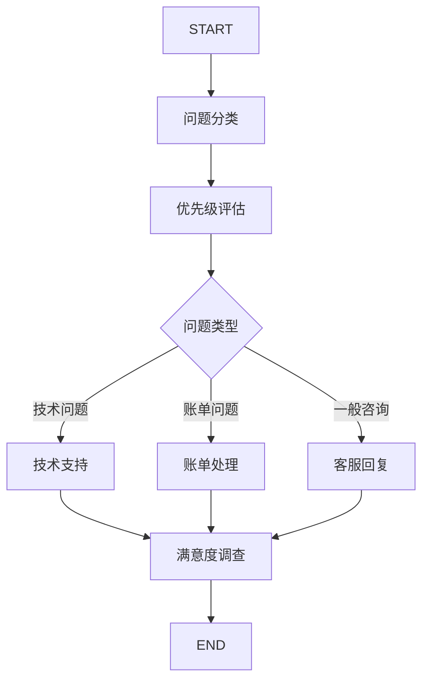

本指南将通过实际示例展示如何使用 Spring AI Alibaba Graph API 构建复杂的工作流应用。我们将从简单的线性流程开始，逐步介绍条件分支、并行处理和高级特性。

## 学习路径

本指南按照以下路径组织，帮助您逐步掌握 Graph API：

1. **基础用法**：从简单的线性图开始，理解基本概念
2. **条件分支**：学习如何根据状态动态选择执行路径
3. **动态路由**：使用 Command 对象实现更灵活的控制流
4. **高级特性**：探索流式执行、检查点、中断恢复等功能
5. **实际应用**：通过完整的业务场景展示最佳实践

## 基础用法

### 1. 创建简单的线性图

线性图是最基础的图结构，节点按照固定的顺序依次执行。这种模式适用于：

- **数据处理管道**：数据需要经过多个步骤的转换和处理
- **工作流程**：业务流程有明确的先后顺序
- **验证链**：需要通过多个验证步骤的场景

让我们从最简单的例子开始 - 一个包含三个顺序执行节点的图：

```java
import com.alibaba.cloud.ai.graph.*;
import com.alibaba.cloud.ai.graph.action.*;
import static com.alibaba.cloud.ai.graph.StateGraph.*;
import static com.alibaba.cloud.ai.graph.action.AsyncNodeAction.node_async;

@Configuration
public class LinearGraphExample {

    @Bean
    public CompiledGraph linearWorkflow() {
        // 定义状态策略
        KeyStrategyFactory keyStrategyFactory = () -> {
            Map<String, KeyStrategy> strategies = new HashMap<>();
            strategies.put("input", KeyStrategy.REPLACE);
            strategies.put("step1_result", KeyStrategy.REPLACE);
            strategies.put("step2_result", KeyStrategy.REPLACE);
            strategies.put("final_result", KeyStrategy.REPLACE);
            return strategies;
        };

        // 定义节点动作
        NodeAction step1Action = state -> {
            String input = state.value("input", String.class).orElse("");
            String result = "步骤1处理: " + input;
            System.out.println("执行步骤1: " + result);
            return Map.of("step1_result", result);
        };

        NodeAction step2Action = state -> {
            String step1Result = state.value("step1_result", String.class).orElse("");
            String result = "步骤2处理: " + step1Result;
            System.out.println("执行步骤2: " + result);
            return Map.of("step2_result", result);
        };

        NodeAction step3Action = state -> {
            String step2Result = state.value("step2_result", String.class).orElse("");
            String result = "步骤3处理: " + step2Result;
            System.out.println("执行步骤3: " + result);
            return Map.of("final_result", result);
        };

        // 构建线性图
        StateGraph graph = new StateGraph(keyStrategyFactory)
            .addNode("step1", node_async(step1Action))
            .addNode("step2", node_async(step2Action))
            .addNode("step3", node_async(step3Action))

            .addEdge(START, "step1")
            .addEdge("step1", "step2")
            .addEdge("step2", "step3")
            .addEdge("step3", END);

        return graph.compile();
    }
}
```

运行这个图：

```java
@Service
public class GraphService {

    @Autowired
    private CompiledGraph linearWorkflow;

    public String processLinear(String input) {
        Optional<OverAllState> result = linearWorkflow.invoke(Map.of("input", input));
        return result.map(state ->
            state.value("final_result", String.class).orElse("无结果")
        ).orElse("执行失败");
    }
}
```

### 2. 条件分支图

条件分支是 Graph 框架的核心特性之一，它允许根据运行时的状态动态选择执行路径。这种模式在以下场景中非常有用：

- **智能路由**：根据输入内容的特征选择不同的处理策略
- **错误处理**：根据错误类型选择不同的恢复策略
- **业务规则**：根据业务规则动态调整处理流程
- **A/B 测试**：根据用户特征选择不同的算法或模型

#### 条件分支的工作原理

条件分支通过以下组件实现：

1. **分类节点**：分析输入并生成分类结果
2. **路由逻辑**：基于分类结果决定下一个节点
3. **处理节点**：针对不同分类的专门处理逻辑

现在让我们创建一个包含条件分支的图，根据输入内容选择不同的处理路径：

```java
import static com.alibaba.cloud.ai.graph.action.AsyncEdgeAction.edge_async;

@Configuration
public class ConditionalGraphExample {

    @Bean
    public CompiledGraph conditionalWorkflow() {
        KeyStrategyFactory keyStrategyFactory = () -> {
            Map<String, KeyStrategy> strategies = new HashMap<>();
            strategies.put("input", KeyStrategy.REPLACE);
            strategies.put("category", KeyStrategy.REPLACE);
            strategies.put("result", KeyStrategy.REPLACE);
            return strategies;
        };

        // 分类节点
        NodeAction classifierAction = state -> {
            String input = state.value("input", String.class).orElse("");
            String category;

            if (input.contains("紧急")) {
                category = "urgent";
            } else if (input.contains("普通")) {
                category = "normal";
            } else {
                category = "unknown";
            }

            System.out.println("分类结果: " + category);
            return Map.of("category", category);
        };

        // 紧急处理节点
        NodeAction urgentAction = state -> {
            String input = state.value("input", String.class).orElse("");
            String result = "紧急处理: " + input;
            System.out.println("执行紧急处理");
            return Map.of("result", result);
        };

        // 普通处理节点
        NodeAction normalAction = state -> {
            String input = state.value("input", String.class).orElse("");
            String result = "普通处理: " + input;
            System.out.println("执行普通处理");
            return Map.of("result", result);
        };

        // 默认处理节点
        NodeAction defaultAction = state -> {
            String input = state.value("input", String.class).orElse("");
            String result = "默认处理: " + input;
            System.out.println("执行默认处理");
            return Map.of("result", result);
        };

        // 路由逻辑
        EdgeAction routingLogic = state -> {
            String category = state.value("category", String.class).orElse("unknown");
            return category; // 直接返回分类结果作为下一个节点名
        };

        // 构建条件图
        StateGraph graph = new StateGraph(keyStrategyFactory)
            .addNode("classifier", node_async(classifierAction))
            .addNode("urgent", node_async(urgentAction))
            .addNode("normal", node_async(normalAction))
            .addNode("unknown", node_async(defaultAction))

            .addEdge(START, "classifier")
            .addConditionalEdges("classifier", edge_async(routingLogic), Map.of(
                "urgent", "urgent",
                "normal", "normal",
                "unknown", "unknown"
            ))
            .addEdge("urgent", END)
            .addEdge("normal", END)
            .addEdge("unknown", END);

        return graph.compile();
    }
}
```

### 3. 使用 Command 进行动态路由

`Command` 是 Spring AI Alibaba Graph 的一个强大特性，它允许节点在执行过程中同时更新状态和控制流程。这种设计提供了比传统条件边更灵活的控制方式。

#### Command 的优势

与传统的条件边相比，Command 具有以下优势：

1. **原子操作**：在一个操作中同时更新状态和决定下一步，避免了状态不一致
2. **简化逻辑**：减少了额外的路由节点，使图结构更加简洁
3. **动态决策**：可以基于复杂的业务逻辑动态决定下一个节点
4. **错误处理**：可以在出错时直接跳转到错误处理节点

#### Command 的使用场景

- **复杂的业务决策**：需要基于多个条件进行复杂判断的场景
- **早期退出**：在满足特定条件时直接结束流程
- **错误恢复**：在检测到错误时跳转到恢复流程
- **动态工作流**：根据运行时信息动态构建执行路径

Spring AI Alibaba Graph 支持使用 `Command` 对象在节点内部直接控制流程，这类似于 LangGraph 的 Command 功能：

```java
import com.alibaba.cloud.ai.graph.action.Command;
import com.alibaba.cloud.ai.graph.action.CommandAction;

@Configuration
public class CommandGraphExample {

    @Bean
    public CompiledGraph commandWorkflow() {
        KeyStrategyFactory keyStrategyFactory = () -> {
            Map<String, KeyStrategy> strategies = new HashMap<>();
            strategies.put("input", KeyStrategy.REPLACE);
            strategies.put("decision", KeyStrategy.REPLACE);
            strategies.put("result", KeyStrategy.REPLACE);
            return strategies;
        };

        // 使用 Command 的决策节点
        CommandAction decisionAction = state -> {
            String input = state.value("input", String.class).orElse("");

            // 根据输入内容决定下一步
            if (input.contains("A")) {
                return new Command("process_a", Map.of("decision", "选择路径A"));
            } else if (input.contains("B")) {
                return new Command("process_b", Map.of("decision", "选择路径B"));
            } else {
                return new Command(END, Map.of("decision", "直接结束"));
            }
        };

        // 处理A节点
        NodeAction processAAction = state -> {
            System.out.println("执行路径A处理");
            return Map.of("result", "路径A的结果");
        };

        // 处理B节点
        NodeAction processBAction = state -> {
            System.out.println("执行路径B处理");
            return Map.of("result", "路径B的结果");
        };

        // 构建使用Command的图
        StateGraph graph = new StateGraph(keyStrategyFactory)
            .addNode("decision", decisionAction)  // CommandAction 直接添加
            .addNode("process_a", node_async(processAAction))
            .addNode("process_b", node_async(processBAction))

            .addEdge(START, "decision")
            // Command 节点会自动路由，不需要显式添加条件边
            .addEdge("process_a", END)
            .addEdge("process_b", END);

        return graph.compile();
    }
}
```

## 高级特性

### 1. 流式执行和监控

流式执行是 Spring AI Alibaba Graph 的一个重要特性，它允许您实时观察图的执行过程，而不需要等待整个流程完成。这在以下场景中特别有用：

#### 流式执行的优势

- **实时反馈**：用户可以立即看到处理进度，提升用户体验
- **早期发现问题**：可以在问题发生时立即发现，而不是等到最后
- **资源优化**：可以根据中间结果动态调整资源分配
- **调试便利**：便于观察每个节点的执行情况和状态变化

#### 适用场景

- **长时间运行的任务**：用户需要了解处理进度的场景
- **交互式应用**：需要实时显示中间结果的应用
- **监控和调试**：开发和运维阶段的监控需求
- **流式 UI**：构建响应式用户界面

Spring AI Alibaba Graph 支持流式执行，可以实时观察图的执行过程：

```java
@Service
public class StreamingGraphService {

    @Autowired
    private CompiledGraph workflow;

    public void executeWithStreaming(String input) {
        // 流式执行，实时获取每个节点的输出
        workflow.stream(Map.of("input", input))
            .subscribe(nodeOutput -> {
                System.out.println("节点 '" + nodeOutput.nodeId() + "' 执行完成");
                System.out.println("当前状态: " + nodeOutput.state().data());

                // 可以根据节点ID进行特定处理
                switch (nodeOutput.nodeId()) {
                    case "classifier":
                        String category = nodeOutput.state()
                            .value("category", String.class).orElse("");
                        System.out.println("分类结果: " + category);
                        break;
                    case "processor":
                        String result = nodeOutput.state()
                            .value("result", String.class).orElse("");
                        System.out.println("处理结果: " + result);
                        break;
                }
            });
    }
}
```

### 2. 检查点和状态恢复

检查点（Checkpoint）是 Graph 框架的一个关键特性，它允许您在图执行过程中保存状态快照，并在需要时从这些快照恢复执行。这个功能在以下场景中非常重要：

#### 检查点的价值

- **容错能力**：在系统故障时可以从最近的检查点恢复，而不需要重新开始
- **长时间任务**：对于运行时间很长的任务，可以分段执行，避免资源浪费
- **实验和调试**：可以从特定状态开始重复执行，便于调试和优化
- **成本控制**：避免因为后期失败而重复执行昂贵的前期步骤

#### 检查点策略

Spring AI Alibaba Graph 支持多种检查点保存策略：

- **内存保存器**：适用于开发和测试环境
- **文件保存器**：适用于单机部署的生产环境
- **数据库保存器**：适用于分布式环境和需要持久化的场景
- **Redis 保存器**：适用于需要高性能和分布式访问的场景

使用检查点功能可以保存图的执行状态，支持中断和恢复：

```java
import com.alibaba.cloud.ai.graph.checkpoint.savers.MemorySaver;
import com.alibaba.cloud.ai.graph.checkpoint.config.SaverConfig;
import com.alibaba.cloud.ai.graph.checkpoint.constant.SaverConstant;

@Configuration
public class CheckpointGraphExample {

    @Bean
    public CompiledGraph checkpointWorkflow() {
        KeyStrategyFactory keyStrategyFactory = () -> {
            Map<String, KeyStrategy> strategies = new HashMap<>();
            strategies.put("input", KeyStrategy.REPLACE);
            strategies.put("step", KeyStrategy.REPLACE);
            strategies.put("result", KeyStrategy.REPLACE);
            return strategies;
        };

        // 配置内存检查点保存器
        MemorySaver memorySaver = new MemorySaver();

        CompileConfig config = CompileConfig.builder()
            .saverConfig(SaverConfig.builder()
                .register(SaverConstant.MEMORY, memorySaver)
                .type(SaverConstant.MEMORY)
                .build())
            .build();

        StateGraph graph = new StateGraph(keyStrategyFactory)
            .addNode("step1", node_async(state -> {
                System.out.println("执行步骤1");
                return Map.of("step", "1", "result", "步骤1完成");
            }))
            .addNode("step2", node_async(state -> {
                System.out.println("执行步骤2");
                return Map.of("step", "2", "result", "步骤2完成");
            }))
            .addNode("step3", node_async(state -> {
                System.out.println("执行步骤3");
                return Map.of("step", "3", "result", "步骤3完成");
            }))

            .addEdge(START, "step1")
            .addEdge("step1", "step2")
            .addEdge("step2", "step3")
            .addEdge("step3", END);

        return graph.compile(config);
    }
}
```

### 3. 中断和恢复执行

中断和恢复是 Graph 框架支持人机协作的核心机制。它允许图在执行过程中暂停，等待外部输入或人工干预，然后继续执行。这个特性在以下场景中非常有用：

#### 中断的应用场景

- **人工审核**：在关键决策点需要人工确认或修改
- **外部依赖**：等待外部系统的响应或用户的输入
- **质量控制**：在重要步骤后进行质量检查
- **合规要求**：某些业务流程需要人工监督和确认

#### 中断类型

Spring AI Alibaba Graph 支持两种类型的中断：

1. **interruptBefore**：在指定节点执行前中断
2. **interruptAfter**：在指定节点执行后中断

#### 中断和恢复的工作流程

1. **配置中断点**：在编译时指定哪些节点需要中断
2. **执行到中断点**：图执行到中断点时自动暂停
3. **外部处理**：人工或外部系统处理中断状态
4. **修改状态**：根据需要修改状态数据
5. **恢复执行**：从中断点继续执行剩余的流程

可以配置图在特定节点前后中断，实现人工干预或异步处理：

```java
@Configuration
public class InterruptibleGraphExample {

    @Bean
    public CompiledGraph interruptibleWorkflow() {
        KeyStrategyFactory keyStrategyFactory = () -> {
            Map<String, KeyStrategy> strategies = new HashMap<>();
            strategies.put("input", KeyStrategy.REPLACE);
            strategies.put("review_needed", KeyStrategy.REPLACE);
            strategies.put("result", KeyStrategy.REPLACE);
            return strategies;
        };

        // 配置中断点
        CompileConfig config = CompileConfig.builder()
            .interruptBefore("human_review")  // 在人工审核前中断
            .build();

        NodeAction analyzeAction = state -> {
            String input = state.value("input", String.class).orElse("");
            boolean needsReview = input.contains("重要");

            return Map.of(
                "analysis", "分析完成",
                "review_needed", needsReview
            );
        };

        NodeAction humanReviewAction = state -> {
            System.out.println("等待人工审核...");
            // 这里会被中断，等待外部恢复
            return Map.of("review_result", "审核通过");
        };

        NodeAction finalizeAction = state -> {
            String analysis = state.value("analysis", String.class).orElse("");
            String review = state.value("review_result", String.class).orElse("");

            return Map.of("result", "最终结果: " + analysis + " + " + review);
        };

        StateGraph graph = new StateGraph(keyStrategyFactory)
            .addNode("analyze", node_async(analyzeAction))
            .addNode("human_review", node_async(humanReviewAction))
            .addNode("finalize", node_async(finalizeAction))

            .addEdge(START, "analyze")
            .addEdge("analyze", "human_review")
            .addEdge("human_review", "finalize")
            .addEdge("finalize", END);

        return graph.compile(config);
    }
}

// 使用中断和恢复
@Service
public class InterruptibleService {

    @Autowired
    private CompiledGraph interruptibleWorkflow;

    public String processWithInterruption(String input) {
        // 第一次执行，会在 human_review 前中断
        Optional<OverAllState> interruptedState = interruptibleWorkflow.invoke(
            Map.of("input", input)
        );

        if (interruptedState.isPresent()) {
            System.out.println("图在人工审核前中断");

            // 模拟人工审核过程
            OverAllState modifiedState = interruptedState.get()
                .update(Map.of("review_result", "人工审核通过"));

            // 从中断点恢复执行
            RunnableConfig resumeConfig = RunnableConfig.builder()
                .resumeFrom(modifiedState)
                .build();

            Optional<OverAllState> finalResult = interruptibleWorkflow.invoke(
                Map.of(), resumeConfig
            );

            return finalResult.map(state ->
                state.value("result", String.class).orElse("无结果")
            ).orElse("执行失败");
        }

        return "未中断，直接完成";
    }
}
```

### 4. 图可视化

Spring AI Alibaba Graph 支持生成图的可视化表示：

```java
@Service
public class GraphVisualizationService {

    @Autowired
    private CompiledGraph workflow;

    public String generateMermaidDiagram() {
        GraphRepresentation mermaid = workflow.getGraph(GraphRepresentation.Type.MERMAID);
        return mermaid.content();
    }

    public String generatePlantUMLDiagram() {
        GraphRepresentation plantuml = workflow.getGraph(GraphRepresentation.Type.PLANTUML);
        return plantuml.content();
    }

    @PostConstruct
    public void printDiagrams() {
        System.out.println("=== Mermaid 图表 ===");
        System.out.println(generateMermaidDiagram());

        System.out.println("\n=== PlantUML 图表 ===");
        System.out.println(generatePlantUMLDiagram());
    }
}
```

### 5. 生命周期监听

可以添加生命周期监听器来监控图的执行过程：

```java
import com.alibaba.cloud.ai.graph.GraphLifecycleListener;

@Configuration
public class MonitoredGraphExample {

    @Bean
    public CompiledGraph monitoredWorkflow() {
        KeyStrategyFactory keyStrategyFactory = () -> {
            Map<String, KeyStrategy> strategies = new HashMap<>();
            strategies.put("input", KeyStrategy.REPLACE);
            strategies.put("result", KeyStrategy.REPLACE);
            return strategies;
        };

        // 创建生命周期监听器
        GraphLifecycleListener listener = new GraphLifecycleListener() {
            @Override
            public void onStart(String nodeId, Map<String, Object> state, RunnableConfig config) {
                System.out.println("节点开始执行: " + nodeId);
                System.out.println("输入状态: " + state);
            }

            @Override
            public void onComplete(String nodeId, Map<String, Object> state, RunnableConfig config) {
                System.out.println("节点执行完成: " + nodeId);
                System.out.println("输出状态: " + state);
            }

            @Override
            public void onError(String nodeId, Map<String, Object> state, Throwable ex, RunnableConfig config) {
                System.err.println("节点执行错误: " + nodeId);
                System.err.println("错误信息: " + ex.getMessage());
            }
        };

        CompileConfig config = CompileConfig.builder()
            .withLifecycleListener(listener)
            .build();

        StateGraph graph = new StateGraph(keyStrategyFactory)
            .addNode("process", node_async(state -> {
                String input = state.value("input", String.class).orElse("");
                return Map.of("result", "处理结果: " + input);
            }))

            .addEdge(START, "process")
            .addEdge("process", END);

        return graph.compile(config);
    }
}
```

## 实际应用示例

### 客户服务工作流

客户服务是一个典型的多步骤、多分支的业务场景，非常适合使用 Graph 框架来实现。这个示例将展示如何构建一个完整的客户服务处理工作流，包含以下特性：

#### 业务需求分析

1. **问题分类**：自动识别客户问题的类型（技术、账单、一般咨询）
2. **优先级评估**：根据问题内容和类型确定处理优先级
3. **专业路由**：将问题路由到相应的专业处理节点
4. **质量保证**：处理完成后进行满意度调查
5. **全程跟踪**：记录完整的处理过程和时间

#### 工作流设计



#### 状态设计

在这个工作流中，我们需要管理以下状态信息：

- **输入信息**：客户问题、用户ID、会话ID
- **分析结果**：问题分类、优先级、关键词
- **处理过程**：处理时间、处理人员、中间结果
- **输出结果**：解决方案、满意度、后续行动

让我们构建一个完整的客户服务处理工作流，展示多种特性的组合使用：

```java
@Configuration
public class CustomerServiceWorkflow {

    @Autowired
    private ChatClient chatClient;

    @Bean
    public CompiledGraph customerServiceGraph() {
        KeyStrategyFactory keyStrategyFactory = () -> {
            Map<String, KeyStrategy> strategies = new HashMap<>();
            strategies.put("input", KeyStrategy.REPLACE);
            strategies.put("category", KeyStrategy.REPLACE);
            strategies.put("priority", KeyStrategy.REPLACE);
            strategies.put("solution", KeyStrategy.REPLACE);
            strategies.put("satisfaction", KeyStrategy.REPLACE);
            return strategies;
        };

        // 问题分类节点
        NodeAction classifyAction = state -> {
            String input = state.value("input", String.class).orElse("");

            String classification = chatClient.prompt()
                .system("你是客服分类专家，请将客户问题分类为：technical（技术问题）、billing（账单问题）、general（一般咨询）")
                .user("客户问题：" + input)
                .call()
                .content();

            return Map.of("category", classification.toLowerCase().trim());
        };

        // 优先级评估节点
        NodeAction priorityAction = state -> {
            String input = state.value("input", String.class).orElse("");
            String category = state.value("category", String.class).orElse("");

            String priority;
            if (input.contains("紧急") || input.contains("无法使用")) {
                priority = "high";
            } else if (category.equals("billing")) {
                priority = "medium";
            } else {
                priority = "low";
            }

            return Map.of("priority", priority);
        };

        // 技术问题处理
        NodeAction technicalAction = state -> {
            String input = state.value("input", String.class).orElse("");

            String solution = chatClient.prompt()
                .system("你是技术支持专家，请提供详细的技术解决方案")
                .user("技术问题：" + input)
                .call()
                .content();

            return Map.of("solution", "技术解决方案：" + solution);
        };

        // 账单问题处理
        NodeAction billingAction = state -> {
            String input = state.value("input", String.class).orElse("");

            String solution = chatClient.prompt()
                .system("你是账单专家，请协助解决账单相关问题")
                .user("账单问题：" + input)
                .call()
                .content();

            return Map.of("solution", "账单解决方案：" + solution);
        };

        // 一般咨询处理
        NodeAction generalAction = state -> {
            String input = state.value("input", String.class).orElse("");

            String solution = chatClient.prompt()
                .system("你是客服代表，请提供友好的帮助")
                .user("客户咨询：" + input)
                .call()
                .content();

            return Map.of("solution", "咨询回复：" + solution);
        };

        // 满意度调查
        NodeAction surveyAction = state -> {
            String solution = state.value("solution", String.class).orElse("");
            System.out.println("解决方案已提供：" + solution);
            System.out.println("请客户评价满意度...");

            return Map.of("satisfaction", "待评价");
        };

        // 路由逻辑
        EdgeAction categoryRouter = state -> {
            String category = state.value("category", String.class).orElse("general");
            return category;
        };

        // 构建完整的客服工作流
        StateGraph graph = new StateGraph(keyStrategyFactory)
            .addNode("classify", node_async(classifyAction))
            .addNode("priority", node_async(priorityAction))
            .addNode("technical", node_async(technicalAction))
            .addNode("billing", node_async(billingAction))
            .addNode("general", node_async(generalAction))
            .addNode("survey", node_async(surveyAction))

            .addEdge(START, "classify")
            .addEdge("classify", "priority")
            .addConditionalEdges("priority", edge_async(categoryRouter), Map.of(
                "technical", "technical",
                "billing", "billing",
                "general", "general"
            ))
            .addEdge("technical", "survey")
            .addEdge("billing", "survey")
            .addEdge("general", "survey")
            .addEdge("survey", END);

        return graph.compile();
    }
}
```

## 高级设计模式

### 1. 管道模式（Pipeline Pattern）

管道模式将复杂的处理过程分解为一系列简单的步骤，每个步骤专注于特定的转换：

```java
@Configuration
public class DataProcessingPipeline {

    @Bean
    public CompiledGraph dataProcessingWorkflow() {
        KeyStrategyFactory keyStrategyFactory = () -> {
            Map<String, KeyStrategy> strategies = new HashMap<>();
            strategies.put("raw_data", KeyStrategy.REPLACE);
            strategies.put("cleaned_data", KeyStrategy.REPLACE);
            strategies.put("transformed_data", KeyStrategy.REPLACE);
            strategies.put("validated_data", KeyStrategy.REPLACE);
            strategies.put("processing_log", KeyStrategy.APPEND);
            return strategies;
        };

        // 数据清洗节点
        NodeAction cleaningAction = state -> {
            Object rawData = state.value("raw_data", Object.class).orElse(null);
            Object cleanedData = performDataCleaning(rawData);

            return Map.of(
                "cleaned_data", cleanedData,
                "processing_log", "数据清洗完成: " + System.currentTimeMillis()
            );
        };

        // 数据转换节点
        NodeAction transformationAction = state -> {
            Object cleanedData = state.value("cleaned_data", Object.class).orElse(null);
            Object transformedData = performDataTransformation(cleanedData);

            return Map.of(
                "transformed_data", transformedData,
                "processing_log", "数据转换完成: " + System.currentTimeMillis()
            );
        };

        // 数据验证节点
        NodeAction validationAction = state -> {
            Object transformedData = state.value("transformed_data", Object.class).orElse(null);

            if (isValidData(transformedData)) {
                return Map.of(
                    "validated_data", transformedData,
                    "processing_log", "数据验证通过: " + System.currentTimeMillis()
                );
            } else {
                return Map.of(
                    "error", "数据验证失败",
                    "processing_log", "数据验证失败: " + System.currentTimeMillis()
                );
            }
        };

        return new StateGraph(keyStrategyFactory)
            .addNode("cleaning", node_async(cleaningAction))
            .addNode("transformation", node_async(transformationAction))
            .addNode("validation", node_async(validationAction))

            .addEdge(START, "cleaning")
            .addEdge("cleaning", "transformation")
            .addEdge("transformation", "validation")
            .addEdge("validation", END)

            .compile();
    }
}
```

### 2. 扇出-扇入模式（Fan-out Fan-in Pattern）

这种模式将任务分发到多个并行处理器，然后汇总结果：

```java
@Configuration
public class ParallelProcessingWorkflow {

    @Bean
    public CompiledGraph parallelWorkflow() {
        KeyStrategyFactory keyStrategyFactory = () -> {
            Map<String, KeyStrategy> strategies = new HashMap<>();
            strategies.put("input", KeyStrategy.REPLACE);
            strategies.put("task_data", KeyStrategy.REPLACE);
            strategies.put("result_a", KeyStrategy.REPLACE);
            strategies.put("result_b", KeyStrategy.REPLACE);
            strategies.put("result_c", KeyStrategy.REPLACE);
            strategies.put("final_result", KeyStrategy.REPLACE);
            return strategies;
        };

        // 任务分发节点
        NodeAction dispatchAction = state -> {
            String input = state.value("input", String.class).orElse("");
            // 将输入数据准备为可并行处理的格式
            Object taskData = prepareTaskData(input);

            return Map.of("task_data", taskData);
        };

        // 并行处理节点 A
        NodeAction processorA = state -> {
            Object taskData = state.value("task_data", Object.class).orElse(null);
            Object result = processWithAlgorithmA(taskData);
            return Map.of("result_a", result);
        };

        // 并行处理节点 B
        NodeAction processorB = state -> {
            Object taskData = state.value("task_data", Object.class).orElse(null);
            Object result = processWithAlgorithmB(taskData);
            return Map.of("result_b", result);
        };

        // 并行处理节点 C
        NodeAction processorC = state -> {
            Object taskData = state.value("task_data", Object.class).orElse(null);
            Object result = processWithAlgorithmC(taskData);
            return Map.of("result_c", result);
        };

        // 结果聚合节点
        NodeAction aggregateAction = state -> {
            Object resultA = state.value("result_a", Object.class).orElse(null);
            Object resultB = state.value("result_b", Object.class).orElse(null);
            Object resultC = state.value("result_c", Object.class).orElse(null);

            Object finalResult = aggregateResults(resultA, resultB, resultC);
            return Map.of("final_result", finalResult);
        };

        return new StateGraph(keyStrategyFactory)
            .addNode("dispatch", node_async(dispatchAction))
            .addNode("processor_a", node_async(processorA))
            .addNode("processor_b", node_async(processorB))
            .addNode("processor_c", node_async(processorC))
            .addNode("aggregate", node_async(aggregateAction))

            .addEdge(START, "dispatch")
            // 扇出：从分发节点到多个处理器
            .addEdge("dispatch", "processor_a")
            .addEdge("dispatch", "processor_b")
            .addEdge("dispatch", "processor_c")
            // 扇入：从多个处理器到聚合节点
            .addEdge("processor_a", "aggregate")
            .addEdge("processor_b", "aggregate")
            .addEdge("processor_c", "aggregate")
            .addEdge("aggregate", END)

            .compile();
    }
}
```

## 最佳实践

### 1. 节点设计原则

#### 单一职责原则

每个节点应该专注于一个明确的任务，这样做的好处包括：

- **易于测试**：单一职责的节点更容易编写单元测试
- **易于维护**：职责明确的代码更容易理解和修改
- **可重用性**：专注的节点可以在不同的工作流中重用
- **错误隔离**：问题更容易定位和修复

```java
// 好的节点设计示例 - 专注于数据验证
NodeAction validationAction = state -> {
    try {
        String input = state.value("input", String.class).orElse("");

        // 输入验证
        ValidationResult validation = validateInput(input);

        if (validation.isValid()) {
            return Map.of(
                "validated_input", input,
                "validation_status", "success",
                "validation_details", validation.getDetails()
            );
        } else {
            return Map.of(
                "validation_status", "failed",
                "validation_errors", validation.getErrors()
            );
        }

    } catch (Exception e) {
        return Map.of(
            "validation_status", "error",
            "error_message", e.getMessage()
        );
    }
};

// 避免的设计 - 职责过多
NodeAction overloadedAction = state -> {
    // 不要在一个节点中做太多事情：
    // 1. 验证输入
    // 2. 调用外部API
    // 3. 处理数据
    // 4. 格式化输出
    // 5. 发送通知
    // 这样的节点难以测试和维护
};
```

#### 幂等性设计

节点应该是幂等的，即多次执行产生相同的结果：

```java
NodeAction idempotentAction = state -> {
    String input = state.value("input", String.class).orElse("");
    String processedKey = "processed_" + input.hashCode();

    // 检查是否已经处理过
    if (state.value(processedKey, String.class).isPresent()) {
        return Map.of(); // 已处理，返回空更新
    }

    // 执行处理逻辑
    String result = processInput(input);

    return Map.of(
        "result", result,
        processedKey, "true"  // 标记已处理
    );
};
```

#### 错误处理策略

在节点内部优雅地处理错误，而不是让异常传播：

```java
NodeAction robustAction = state -> {
    try {
        String input = state.value("input", String.class).orElse("");

        // 前置检查
        if (input.trim().isEmpty()) {
            return Map.of(
                "status", "skipped",
                "reason", "输入为空，跳过处理"
            );
        }

        // 执行核心逻辑
        String result = performProcessing(input);

        return Map.of(
            "result", result,
            "status", "success",
            "processing_time", System.currentTimeMillis()
        );

    } catch (ValidationException e) {
        // 可预期的验证错误
        return Map.of(
            "status", "validation_error",
            "error_message", e.getMessage(),
            "error_code", e.getErrorCode()
        );

    } catch (ExternalServiceException e) {
        // 外部服务错误，可能需要重试
        return Map.of(
            "status", "service_error",
            "error_message", e.getMessage(),
            "retry_suggested", true
        );

    } catch (Exception e) {
        // 未预期的错误
        return Map.of(
            "status", "unexpected_error",
            "error_message", e.getMessage(),
            "stack_trace", getStackTrace(e)
        );
    }
};
```

### 2. 状态管理策略

- **键命名规范**：使用清晰、一致的键名
- **策略选择**：根据数据特性选择合适的合并策略
- **数据类型**：保持状态值的类型一致性
- **大小控制**：避免在状态中存储过大的对象

```java
// 推荐的状态策略配置
KeyStrategyFactory keyStrategyFactory = () -> {
    Map<String, KeyStrategy> strategies = new HashMap<>();

    // 输入数据使用替换策略
    strategies.put("input", KeyStrategy.REPLACE);
    strategies.put("user_id", KeyStrategy.REPLACE);

    // 消息列表使用追加策略
    strategies.put("messages", KeyStrategy.APPEND);
    strategies.put("logs", KeyStrategy.APPEND);

    // 结果数据使用合并策略
    strategies.put("results", KeyStrategy.MERGE);
    strategies.put("metadata", KeyStrategy.MERGE);

    return strategies;
};
```

### 3. 错误处理和监控

- **全局错误处理**：使用生命周期监听器处理全局错误
- **重试机制**：对于临时性错误实现重试逻辑
- **监控指标**：收集关键的执行指标
- **日志记录**：记录详细的执行日志

```java
// 错误处理示例
GraphLifecycleListener errorHandler = new GraphLifecycleListener() {
    @Override
    public void onError(String nodeId, Map<String, Object> state, Throwable ex, RunnableConfig config) {
        // 记录错误日志
        log.error("节点 {} 执行失败", nodeId, ex);

        // 发送告警
        alertService.sendAlert("Graph执行错误", nodeId, ex.getMessage());

        // 记录指标
        meterRegistry.counter("graph.node.error", "node", nodeId).increment();
    }
};
```

## 总结

Spring AI Alibaba Graph 提供了强大而灵活的状态图工作流框架，通过以下特性帮助开发者构建复杂的 AI 应用：

- **直观的 API**：声明式的图构建方式，易于理解和维护
- **灵活的控制流**：支持条件分支、并行执行和动态路由
- **强大的状态管理**：类型安全的状态访问和灵活的更新策略
- **生产级特性**：检查点、中断恢复、监控和可视化
- **Spring 集成**：完整的依赖注入和配置管理支持

通过合理使用这些特性和遵循最佳实践，您可以构建出高效、可靠、可维护的多智能体应用系统。

## 下一步

- [流式处理](./streaming) - 学习如何实现实时的流式输出
- [持久化](./persistence) - 了解检查点和状态恢复机制
- [人机协作](./human-in-the-loop) - 在工作流中集成人工干预
- [子图](./subgraphs) - 构建可复用的子图组件
