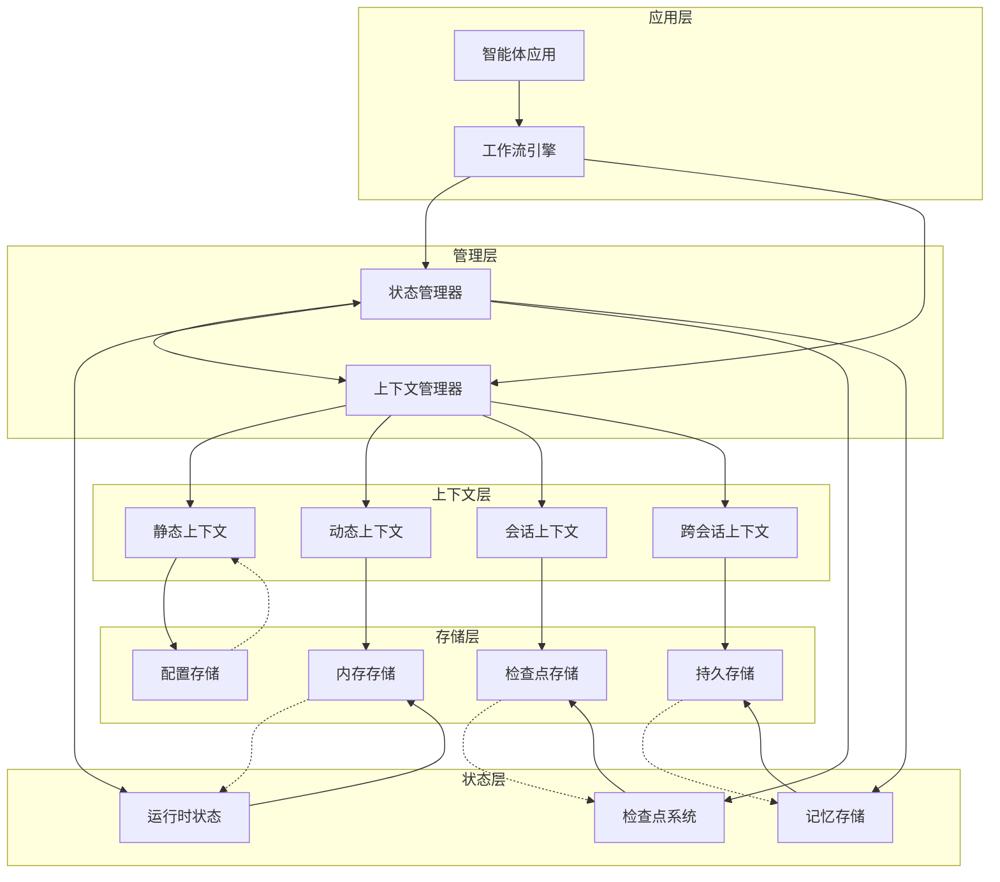

# 状态与上下文管理概览

在构建智能的多智能体系统时，**状态与上下文管理**是确保系统能够有效运行、记忆历史信息并在不同会话间保持连续性的核心机制。Spring AI Alibaba 提供了一套完整的状态与上下文管理体系，涵盖从短期运行时状态到长期跨会话记忆的各个层面。

## 核心概念

### 状态管理
**状态**是智能体在执行过程中需要维护的数据，包括：
- **运行时状态**：单次执行过程中的临时数据
- **持久状态**：需要跨执行保存的数据
- **共享状态**：多个智能体间共享的数据

### 上下文管理
**上下文**是智能体执行任务所需的环境信息，包括：
- **静态上下文**：不变的环境信息（用户元数据、配置等）
- **动态上下文**：随执行变化的信息（对话历史、中间结果等）
- **跨会话上下文**：跨多个会话的持久信息

### 记忆系统
**记忆**是智能体学习和适应的基础，分为：
- **短期记忆**：单个会话内的信息记忆
- **长期记忆**：跨会话的持久记忆
- **工作记忆**：当前任务执行的临时记忆

## 管理维度

Spring AI Alibaba 的状态与上下文管理体系可以从两个关键维度进行理解：

### 按可变性分类

| 类型 | 特征 | 示例 | 管理方式 |
|------|------|------|----------|
| **静态** | 执行期间不变 | 用户元数据、工具定义、配置信息 | `RunnableConfig.metadata` |
| **动态** | 执行期间可变 | 对话历史、中间结果、状态变化 | `OverAllState` 对象 |

### 按生命周期分类

| 类型 | 生命周期 | 示例 | 存储方式 |
|------|----------|------|----------|
| **运行时** | 单次执行 | 当前对话、临时计算结果 | 内存状态 |
| **会话级** | 单个会话 | 会话历史、用户偏好 | 检查点保存器 |
| **跨会话** | 多个会话 | 用户档案、学习记忆 | 持久存储 |

## 技术架构

## 核心组件

### 1. 状态图 (StateGraph)
- 管理工作流的状态转换
- 支持状态的自动保存和恢复
- 提供状态历史追踪

### 2. 检查点保存器 (CheckpointSaver)
- 自动保存执行状态
- 支持状态恢复和时间旅行
- 提供多种存储后端

### 3. 记忆存储 (Memory Store)
- 管理长期记忆数据
- 支持语义搜索和过滤
- 提供命名空间隔离

### 4. 上下文管理器
- 统一管理各类上下文信息
- 支持上下文的动态注入
- 提供上下文生命周期管理

## 下一步

本概览为您介绍了 Spring AI Alibaba 状态与上下文管理的整体架构。接下来，您可以深入了解各个具体方面：

- [基础概念](./fundamentals.md) - 深入理解核心概念和原理
- [短期状态管理](./short-term-state.md) - 运行时状态和短期记忆管理
- [长期状态管理](./long-term-state.md) - 持久化和长期记忆管理
- [持久执行](./durable-execution.md) - 持久执行机制和最佳实践
- [上下文工程](./context-engineering.md) - 上下文管理的高级技巧
- [实践指南](./best-practices.md) - 实际应用中的最佳实践

通过这套完整的状态与上下文管理体系，您可以构建出更加智能、可靠和用户友好的多智能体应用。
