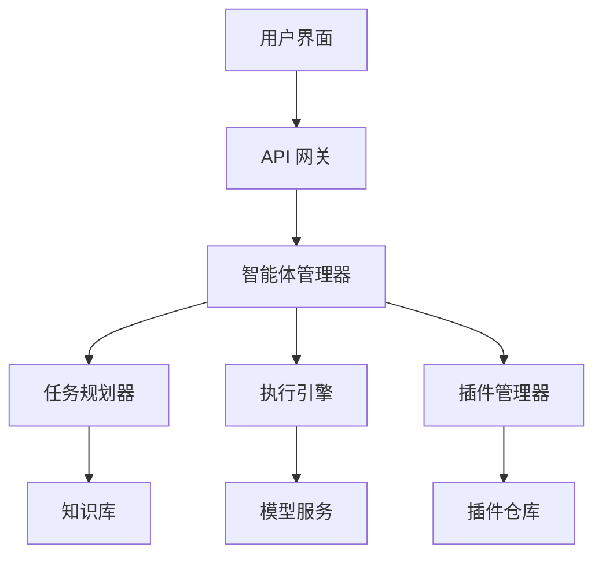

# JManus

JManus 是基于 Spring AI Alibaba 构建的通用智能体平台，提供完整的智能体生命周期管理和自主规划能力。

## 平台概述

### 核心特性
- **自主规划**: 智能体具备自主任务分解和执行规划能力
- **多模态支持**: 支持文本、图像、音频等多种输入输出
- **插件生态**: 丰富的插件系统，支持自定义扩展
- **可视化管理**: 直观的 Web 界面进行智能体管理
- **企业级部署**: 支持分布式部署和高可用架构

### 架构设计



## 快速开始

### 环境准备

```bash
# 克隆项目
git clone https://github.com/springaialibaba/jmanus.git
cd jmanus

# 配置环境变量
cp .env.example .env
# 编辑 .env 文件，配置必要的 API 密钥
```

### Docker 部署

```yaml
# docker-compose.yml
version: '3.8'
services:
  jmanus-backend:
    image: springai/jmanus-backend:latest
    ports:
      - "8080:8080"
    environment:
      - SPRING_PROFILES_ACTIVE=docker
      - DASHSCOPE_API_KEY=${DASHSCOPE_API_KEY}
    depends_on:
      - postgres
      - redis
  
  jmanus-frontend:
    image: springai/jmanus-frontend:latest
    ports:
      - "3000:3000"
    environment:
      - REACT_APP_API_URL=http://localhost:8080
  
  postgres:
    image: postgres:15
    environment:
      - POSTGRES_DB=jmanus
      - POSTGRES_USER=jmanus
      - POSTGRES_PASSWORD=password
    volumes:
      - postgres_data:/var/lib/postgresql/data
  
  redis:
    image: redis:7-alpine
    ports:
      - "6379:6379"

volumes:
  postgres_data:
```

### 启动服务

```bash
# 启动所有服务
docker-compose up -d

# 查看服务状态
docker-compose ps

# 访问前端界面
open http://localhost:3000
```

## 智能体创建

### 通过 Web 界面创建

1. **登录系统**: 访问 `http://localhost:3000` 并登录
2. **创建智能体**: 点击"新建智能体"按钮
3. **配置基本信息**: 设置名称、描述、类型等
4. **选择能力**: 配置智能体的核心能力和插件
5. **测试部署**: 进行功能测试并部署

### 通过 API 创建

```java
@RestController
@RequestMapping("/api/agents")
public class AgentController {
    
    @Autowired
    private AgentService agentService;
    
    @PostMapping
    public ResponseEntity<Agent> createAgent(@RequestBody CreateAgentRequest request) {
        Agent agent = agentService.createAgent(
            AgentDefinition.builder()
                .name(request.getName())
                .description(request.getDescription())
                .type(request.getType())
                .capabilities(request.getCapabilities())
                .plugins(request.getPlugins())
                .build()
        );
        
        return ResponseEntity.ok(agent);
    }
}
```

### 配置文件创建

```yaml
# agent-config.yml
agent:
  name: "客服助手"
  description: "智能客服智能体，处理用户咨询和问题解答"
  type: "customer-service"
  
  capabilities:
    - name: "问答"
      type: "qa"
      config:
        knowledge_base: "customer-kb"
        confidence_threshold: 0.8
    
    - name: "情感分析"
      type: "sentiment"
      config:
        model: "sentiment-analysis-v1"
    
    - name: "工单创建"
      type: "ticket"
      config:
        system: "jira"
        project: "SUPPORT"
  
  plugins:
    - name: "knowledge-search"
      version: "1.0.0"
    - name: "ticket-manager"
      version: "2.1.0"
  
  settings:
    max_conversation_length: 50
    response_timeout: 30s
    auto_escalation: true
```

## 自主规划能力

### 任务分解

```java
@Component
public class TaskPlanner {
    
    @Autowired
    private ChatClient chatClient;
    
    public TaskPlan planTask(String objective) {
        String planningPrompt = String.format("""
            作为任务规划专家，请将以下目标分解为具体的执行步骤：
            
            目标：%s
            
            请按照以下格式输出：
            1. 步骤名称 - 步骤描述 - 所需能力 - 预估时间
            2. ...
            
            确保步骤之间有逻辑顺序，每个步骤都是可执行的。
            """, objective);
        
        String planText = chatClient.prompt()
            .user(planningPrompt)
            .call()
            .content();
        
        return parsePlan(planText);
    }
    
    private TaskPlan parsePlan(String planText) {
        List<TaskStep> steps = Arrays.stream(planText.split("\n"))
            .filter(line -> line.matches("\\d+\\..*"))
            .map(this::parseStep)
            .collect(Collectors.toList());
        
        return TaskPlan.builder()
            .steps(steps)
            .createdAt(Instant.now())
            .build();
    }
}
```

### 动态调整

```java
@Component
public class AdaptivePlanner {
    
    public TaskPlan adjustPlan(TaskPlan originalPlan, ExecutionContext context) {
        // 分析当前执行情况
        ExecutionAnalysis analysis = analyzeExecution(context);
        
        if (analysis.needsAdjustment()) {
            String adjustmentPrompt = String.format("""
                原始计划执行遇到问题，需要调整：
                
                原始计划：%s
                当前状态：%s
                遇到问题：%s
                
                请提供调整后的计划。
                """, 
                originalPlan.toString(),
                context.getCurrentStatus(),
                analysis.getIssues()
            );
            
            String adjustedPlanText = chatClient.prompt()
                .user(adjustmentPrompt)
                .call()
                .content();
            
            return parsePlan(adjustedPlanText);
        }
        
        return originalPlan;
    }
}
```

## 插件系统

### 插件接口

```java
public interface JManusPlugin {
    
    String getName();
    String getVersion();
    String getDescription();
    
    void initialize(PluginContext context);
    void shutdown();
    
    List<Capability> getCapabilities();
    PluginResult execute(PluginRequest request);
}
```

### 示例插件

```java
@Plugin(name = "web-search", version = "1.0.0")
public class WebSearchPlugin implements JManusPlugin {
    
    @Autowired
    private WebSearchService searchService;
    
    @Override
    public String getName() {
        return "web-search";
    }
    
    @Override
    public List<Capability> getCapabilities() {
        return List.of(
            Capability.builder()
                .name("search")
                .description("搜索网络信息")
                .parameters(Map.of(
                    "query", "搜索关键词",
                    "limit", "结果数量限制"
                ))
                .build()
        );
    }
    
    @Override
    public PluginResult execute(PluginRequest request) {
        String query = request.getParameter("query");
        int limit = request.getParameter("limit", 10);
        
        List<SearchResult> results = searchService.search(query, limit);
        
        return PluginResult.success(results);
    }
}
```

### 插件管理

```java
@Service
public class PluginManager {
    
    private final Map<String, JManusPlugin> plugins = new ConcurrentHashMap<>();
    
    public void loadPlugin(String pluginPath) {
        try {
            JManusPlugin plugin = loadPluginFromPath(pluginPath);
            plugin.initialize(createPluginContext());
            plugins.put(plugin.getName(), plugin);
            
            log.info("Plugin loaded: {} v{}", plugin.getName(), plugin.getVersion());
        } catch (Exception e) {
            log.error("Failed to load plugin: {}", pluginPath, e);
        }
    }
    
    public PluginResult executePlugin(String pluginName, PluginRequest request) {
        JManusPlugin plugin = plugins.get(pluginName);
        if (plugin == null) {
            return PluginResult.error("Plugin not found: " + pluginName);
        }
        
        try {
            return plugin.execute(request);
        } catch (Exception e) {
            log.error("Plugin execution failed: {}", pluginName, e);
            return PluginResult.error("Execution failed: " + e.getMessage());
        }
    }
}
```

## 知识库集成

### 知识库配置

```java
@Configuration
public class KnowledgeBaseConfig {
    
    @Bean
    public VectorStore vectorStore() {
        return new PineconeVectorStore(
            PineconeVectorStoreConfig.builder()
                .apiKey("${pinecone.api-key}")
                .environment("${pinecone.environment}")
                .indexName("jmanus-knowledge")
                .build()
        );
    }
    
    @Bean
    public DocumentProcessor documentProcessor() {
        return DocumentProcessor.builder()
            .textSplitter(new TokenTextSplitter(500, 50))
            .embeddingModel(embeddingModel())
            .build();
    }
}
```

### 知识检索

```java
@Service
public class KnowledgeService {
    
    @Autowired
    private VectorStore vectorStore;
    
    public List<Document> searchKnowledge(String query, int limit) {
        return vectorStore.similaritySearch(
            SearchRequest.query(query)
                .withTopK(limit)
                .withSimilarityThreshold(0.7)
        );
    }
    
    public void addKnowledge(String content, Map<String, Object> metadata) {
        Document document = new Document(content, metadata);
        vectorStore.add(List.of(document));
    }
    
    public void updateKnowledge(String documentId, String newContent) {
        vectorStore.delete(List.of(documentId));
        addKnowledge(newContent, Map.of("updated", Instant.now()));
    }
}
```

## 对话管理

### 会话状态

```java
@Entity
@Table(name = "conversations")
public class Conversation {
    @Id
    private String id;
    
    @Column(name = "agent_id")
    private String agentId;
    
    @Column(name = "user_id")
    private String userId;
    
    @Enumerated(EnumType.STRING)
    private ConversationStatus status;
    
    @Column(name = "context", columnDefinition = "jsonb")
    private Map<String, Object> context;
    
    @Column(name = "created_at")
    private Instant createdAt;
    
    @Column(name = "updated_at")
    private Instant updatedAt;
    
    // getters and setters
}
```

### 对话处理

```java
@Service
public class ConversationService {
    
    @Autowired
    private ConversationRepository conversationRepository;
    
    @Autowired
    private AgentService agentService;
    
    public ConversationResponse processMessage(String conversationId, String message) {
        Conversation conversation = conversationRepository.findById(conversationId)
            .orElseThrow(() -> new ConversationNotFoundException(conversationId));
        
        Agent agent = agentService.getAgent(conversation.getAgentId());
        
        // 更新对话上下文
        conversation.getContext().put("lastMessage", message);
        conversation.getContext().put("lastMessageTime", Instant.now());
        
        // 处理消息
        String response = agent.processMessage(message, conversation.getContext());
        
        // 保存对话记录
        saveMessage(conversationId, message, response);
        
        // 更新对话状态
        conversation.setUpdatedAt(Instant.now());
        conversationRepository.save(conversation);
        
        return ConversationResponse.builder()
            .conversationId(conversationId)
            .response(response)
            .timestamp(Instant.now())
            .build();
    }
}
```

## 监控和分析

### 性能监控

```java
@Component
public class AgentMonitor {
    
    @EventListener
    public void onAgentExecution(AgentExecutionEvent event) {
        AgentMetrics metrics = AgentMetrics.builder()
            .agentId(event.getAgentId())
            .taskType(event.getTaskType())
            .executionTime(event.getExecutionTime())
            .success(event.isSuccess())
            .timestamp(event.getTimestamp())
            .build();
        
        metricsRepository.save(metrics);
    }
    
    @Scheduled(fixedRate = 60000)
    public void generateReport() {
        List<Agent> agents = agentService.getAllAgents();
        
        for (Agent agent : agents) {
            AgentPerformanceReport report = generatePerformanceReport(agent.getId());
            reportService.saveReport(report);
            
            if (report.getSuccessRate() < 0.8) {
                alertService.sendAlert("智能体性能告警", 
                    "智能体 " + agent.getName() + " 成功率低于 80%");
            }
        }
    }
}
```

### 用户行为分析

```java
@Service
public class UserAnalyticsService {
    
    public UserBehaviorReport analyzeUserBehavior(String userId, Duration period) {
        List<ConversationMessage> messages = messageRepository
            .findByUserIdAndTimestampAfter(userId, Instant.now().minus(period));
        
        return UserBehaviorReport.builder()
            .userId(userId)
            .totalMessages(messages.size())
            .averageSessionLength(calculateAverageSessionLength(messages))
            .mostUsedFeatures(findMostUsedFeatures(messages))
            .satisfactionScore(calculateSatisfactionScore(messages))
            .build();
    }
}
```

## 配置选项

```properties
# JManus 核心配置
jmanus.agent.max-concurrent-tasks=10
jmanus.agent.task-timeout=300s
jmanus.agent.auto-scaling=true

# 插件配置
jmanus.plugins.directory=/plugins
jmanus.plugins.auto-load=true
jmanus.plugins.security.enabled=true

# 知识库配置
jmanus.knowledge.vector-store=pinecone
jmanus.knowledge.embedding-model=text-embedding-ada-002
jmanus.knowledge.chunk-size=500

# 监控配置
jmanus.monitoring.enabled=true
jmanus.monitoring.metrics.export.prometheus=true
jmanus.monitoring.alerts.email=admin@example.com
```

## 最佳实践

### 1. 智能体设计
- 明确智能体的职责边界
- 设计合理的能力组合
- 实现优雅的错误处理

### 2. 插件开发
- 遵循单一职责原则
- 提供详细的文档说明
- 实现完善的测试用例

### 3. 性能优化
- 合理配置并发参数
- 实施缓存策略
- 监控资源使用情况

### 4. 安全考虑
- 实施访问控制
- 验证输入数据
- 保护敏感信息

## 下一步

- [探索 DeepResearch](/docs/develop/playground/deepresearch/)
- [学习 NL2SQL](/docs/develop/playground/nl2sql/)
- [了解多智能体架构](/docs/develop/multi-agent/architectures/)
