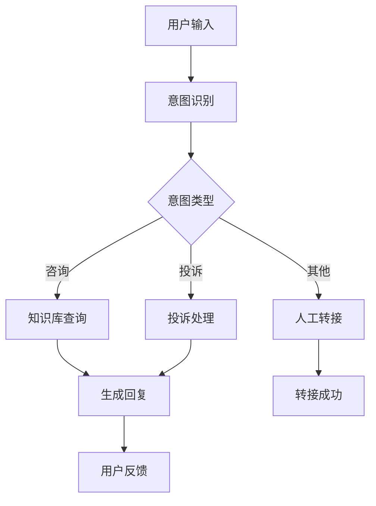

# Studio

Spring AI Alibaba Studio 是一个集成开发环境，为开发者提供可视化的智能体构建、调试和部署工具。

## 功能概览

### 1. 可视化编辑器
- 拖拽式智能体设计
- 实时预览和调试
- 代码自动生成

### 2. 模型管理
- 多模型支持
- 模型性能对比
- 参数调优

### 3. 工作流设计
- 图形化流程编排
- 条件分支设计
- 并行处理配置

### 4. 测试和调试
- 实时测试环境
- 调试工具
- 性能分析

## 快速开始

### 安装 Studio

```bash
# 使用 Docker 安装
docker run -d \
  --name spring-ai-studio \
  -p 8080:8080 \
  -v $(pwd)/workspace:/workspace \
  springai/alibaba-studio:latest

# 或者使用 JAR 包
java -jar spring-ai-alibaba-studio-1.0.0.3.jar
```

### 访问 Studio

打开浏览器访问 `http://localhost:8080`，您将看到 Studio 的主界面。

## 创建第一个智能体

### 1. 新建项目

1. 点击 "新建项目"
2. 选择项目模板（单智能体/多智能体/工作流）
3. 配置项目基本信息

### 2. 设计智能体

```java
// Studio 自动生成的代码示例
@Component
public class CustomerServiceAgent {
    
    @Autowired
    private ChatClient chatClient;
    
    @AgentFunction(name = "handleCustomerQuery")
    public String handleQuery(String query) {
        return chatClient.prompt()
            .user("作为客服代表，请回答客户问题：" + query)
            .call()
            .content();
    }
}
```

### 3. 配置模型

在 Studio 界面中配置模型参数：

```properties
# 模型配置
spring.ai.dashscope.api-key=${DASHSCOPE_API_KEY}
spring.ai.dashscope.chat.options.model=qwen-max
spring.ai.dashscope.chat.options.temperature=0.7
spring.ai.dashscope.chat.options.max-tokens=2000
```

## 可视化工作流

### 创建工作流

1. **拖拽节点**: 从组件库拖拽智能体节点到画布
2. **连接节点**: 使用连线定义执行顺序
3. **配置节点**: 设置每个节点的参数和逻辑

### 工作流示例



### 生成代码

Studio 会自动生成对应的 Spring AI Alibaba 代码：

```java
@Component
public class CustomerServiceWorkflow {
    
    public StateGraph createWorkflow() {
        return StateGraph.builder(CustomerState.class)
            .addNode("intent_recognition", this::recognizeIntent)
            .addNode("knowledge_query", this::queryKnowledge)
            .addNode("complaint_handling", this::handleComplaint)
            .addNode("human_transfer", this::transferToHuman)
            .addNode("generate_response", this::generateResponse)
            .addConditionalEdges("intent_recognition", this::routeByIntent)
            .addEdge("knowledge_query", "generate_response")
            .addEdge("complaint_handling", "generate_response")
            .setEntryPoint("intent_recognition")
            .setFinishPoint("generate_response")
            .build();
    }
}
```

## 调试工具

### 1. 实时调试

```java
@RestController
public class DebugController {
    
    @Autowired
    private StateGraph workflow;
    
    @PostMapping("/debug/step")
    public DebugResponse debugStep(@RequestBody DebugRequest request) {
        // 单步执行
        GraphExecution execution = workflow.createExecution(request.getState());
        ExecutionResult result = execution.executeStep(request.getNodeId());
        
        return DebugResponse.builder()
            .nodeId(request.getNodeId())
            .inputState(request.getState())
            .outputState(result.getState())
            .executionTime(result.getExecutionTime())
            .logs(result.getLogs())
            .build();
    }
}
```

### 2. 状态检查

Studio 提供状态检查器，可以查看每个节点的输入输出状态：

```java
@Component
public class StateInspector {
    
    public StateSnapshot captureState(String executionId, String nodeId) {
        GraphExecution execution = executionRegistry.getExecution(executionId);
        OverallState state = execution.getStateAtNode(nodeId);
        
        return StateSnapshot.builder()
            .executionId(executionId)
            .nodeId(nodeId)
            .state(state)
            .timestamp(Instant.now())
            .build();
    }
    
    public List<StateSnapshot> getExecutionHistory(String executionId) {
        return stateRepository.findByExecutionIdOrderByTimestamp(executionId);
    }
}
```

### 3. 性能分析

```java
@Component
public class PerformanceProfiler {
    
    @EventListener
    public void onNodeExecution(NodeExecutionEvent event) {
        NodePerformance performance = NodePerformance.builder()
            .nodeId(event.getNodeId())
            .executionTime(event.getExecutionTime())
            .memoryUsage(event.getMemoryUsage())
            .cpuUsage(event.getCpuUsage())
            .timestamp(event.getTimestamp())
            .build();
        
        performanceRepository.save(performance);
    }
    
    public PerformanceReport generateReport(String workflowId, Duration period) {
        List<NodePerformance> performances = performanceRepository
            .findByWorkflowIdAndTimestampAfter(workflowId, Instant.now().minus(period));
        
        return PerformanceReport.builder()
            .workflowId(workflowId)
            .totalExecutions(performances.size())
            .averageExecutionTime(calculateAverageTime(performances))
            .bottlenecks(identifyBottlenecks(performances))
            .recommendations(generateRecommendations(performances))
            .build();
    }
}
```

## 模型对比

### A/B 测试

Studio 支持多模型 A/B 测试：

```java
@Component
public class ModelComparison {
    
    @Autowired
    @Qualifier("qwenModel")
    private ChatModel qwenModel;
    
    @Autowired
    @Qualifier("gptModel")
    private ChatModel gptModel;
    
    public ComparisonResult compareModels(List<TestCase> testCases) {
        List<ModelResult> qwenResults = new ArrayList<>();
        List<ModelResult> gptResults = new ArrayList<>();
        
        for (TestCase testCase : testCases) {
            // 测试 Qwen 模型
            String qwenResponse = qwenModel.call(testCase.getPrompt());
            qwenResults.add(new ModelResult(testCase, qwenResponse));
            
            // 测试 GPT 模型
            String gptResponse = gptModel.call(testCase.getPrompt());
            gptResults.add(new ModelResult(testCase, gptResponse));
        }
        
        return ComparisonResult.builder()
            .qwenResults(qwenResults)
            .gptResults(gptResults)
            .winner(determineWinner(qwenResults, gptResults))
            .build();
    }
}
```

## 部署和发布

### 1. 本地部署

```bash
# 生成部署包
mvn clean package -P production

# 启动应用
java -jar target/my-agent-app-1.0.0.jar
```

### 2. Docker 部署

Studio 自动生成 Dockerfile：

```dockerfile
FROM openjdk:17-jre-slim

COPY target/my-agent-app-1.0.0.jar app.jar

EXPOSE 8080

ENTRYPOINT ["java", "-jar", "/app.jar"]
```

### 3. Kubernetes 部署

生成 Kubernetes 配置：

```yaml
apiVersion: apps/v1
kind: Deployment
metadata:
  name: my-agent-app
spec:
  replicas: 3
  selector:
    matchLabels:
      app: my-agent-app
  template:
    metadata:
      labels:
        app: my-agent-app
    spec:
      containers:
      - name: app
        image: my-agent-app:1.0.0
        ports:
        - containerPort: 8080
        env:
        - name: SPRING_PROFILES_ACTIVE
          value: "production"
```

## 插件系统

### 创建自定义插件

```java
@StudioPlugin(name = "custom-evaluator", version = "1.0.0")
public class CustomEvaluatorPlugin implements StudioPluginInterface {
    
    @Override
    public void initialize(StudioContext context) {
        context.registerEvaluator("custom", new CustomEvaluator());
        context.registerComponent("CustomNode", CustomNodeComponent.class);
    }
    
    @Override
    public List<ToolbarItem> getToolbarItems() {
        return List.of(
            ToolbarItem.builder()
                .name("Custom Evaluator")
                .icon("evaluate")
                .action("openCustomEvaluator")
                .build()
        );
    }
}
```

### 插件配置

```properties
# 插件配置
spring.ai.studio.plugins.enabled=true
spring.ai.studio.plugins.directory=/plugins
spring.ai.studio.plugins.auto-load=true
```

## 最佳实践

### 1. 项目组织
- 使用清晰的命名规范
- 合理组织项目结构
- 添加详细的文档说明

### 2. 版本管理
- 使用 Git 进行版本控制
- 定期创建检查点
- 记录重要变更

### 3. 测试策略
- 编写全面的测试用例
- 进行性能测试
- 实施持续集成

### 4. 监控和维护
- 设置监控告警
- 定期检查性能
- 及时更新依赖

## 社区和支持

### 官方资源
- [Studio 文档](https://docs.spring-ai-alibaba.com/studio)
- [示例项目](https://github.com/springaialibaba/studio-examples)
- [插件市场](https://marketplace.spring-ai-alibaba.com)

### 社区支持
- [GitHub Issues](https://github.com/alibaba/spring-ai-alibaba/issues)
- [讨论论坛](https://github.com/alibaba/spring-ai-alibaba/discussions)
- [微信群](https://java2ai.com/community)

## 下一步

- [探索 JManus](/docs/develop/playground/jmanus/)
- [了解 DeepResearch](/docs/develop/playground/deepresearch/)
- [学习 NL2SQL](/docs/develop/playground/nl2sql/)
